# Módulo 6: Capa de enlace de datos

---

## Contenido

- **Propósito de la capa de enlace de datos:** Describe el propósito y la función de la capa de enlace de datos al preparar comunicación para su transmisión en medios específicos.

- **Topologías:** Compara las características de los métodos de control de acceso a medios en WAN y LAN. Topologías LAN.

- **Trama de enlace de datos:** Describe las características y las funciones de la trama de enlace de datos.

---

### Propósito de la capa de enlace de datos

La capa de enlace de datos (Capa 2 del modelo OSI) se encarga de que la comunicación entre dispositivos (como tarjetas de red o NICs) sea confiable sobre un medio físico.

- **Interfaz con capas superiores:** Sirve de puente para que las capas superiores (como la de red) puedan usar el medio físico sin preocuparse por su tipo.

- **Encapsulación:** Toma los paquetes de la capa 3 (IPv4 o IPv6) y los convierte en tramas, que son la unidad de datos en esta capa.

- **Control del medio:** Define cómo se colocan y se reciben los datos en el medio (cables, Wi-Fi, fibra, etc.).

- **Transmisión de tramas:** Se asegura de que las tramas lleguen desde un dispositivo hasta otro.

- **Entrega al protocolo correcto:** Una vez recibe datos, los entrega a la capa superior adecuada (ejemplo: IPv4 o IPv6).

- **Detección de errores:** Revisa si las tramas están dañadas y descarta las incorrectas.

La capa de enlace de datos prepara los datos de red para la red física.

- **Nodo en redes:** Un nodo es cualquier dispositivo conectado a la red que puede manejar datos. Puede ser un dispositivo final (PC, laptop, celular) o un dispositivo intermediario (switch, router, etc.).

- **Función de la capa de enlace de datos:**
  
  - Evita que la capa de red (IP) tenga que preocuparse por los distintos tipos de medios físicos (cobre, fibra, Wi-Fi).
  
  - Si no existiera, cada protocolo de red tendría que adaptarse manualmente a cada nueva tecnología de transmisión.

- **Encapsulación en Capa 2:**
  
  - Cuando un paquete de Capa 3 (ejemplo: IPv4/IPv6) viaja por la red, la capa de enlace de datos (Capa 2) le añade información de control en forma de trama.
  
  - Esa información incluye:
    
    - **Dirección MAC de destino (Ethernet).**
    
    - **Dirección MAC de origen (NIC del emisor).**
  
  - Luego, la trama se transforma en señales entendibles para la capa física (Capa 1), que finalmente la transmite por el medio.

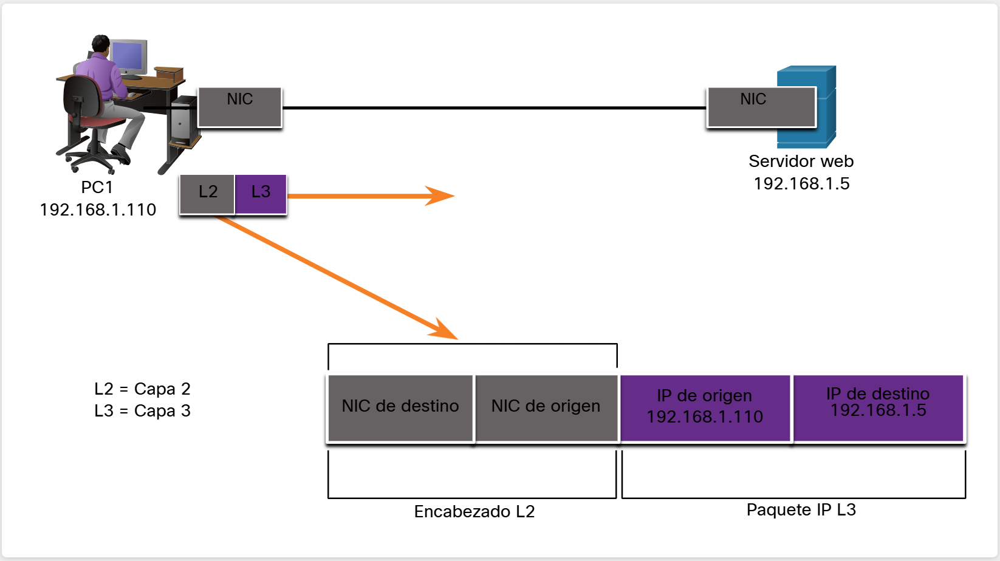

#### Subcapas de enlace de datos IEEE 802 LAN/MAN

Los estándares IEEE 802 LAN/MAN definen cómo funcionan las redes locales (LAN) y metropolitanas (MAN), tanto cableadas como inalámbricas (Ethernet, Wi-Fi, Bluetooth, etc.).

Dentro de la capa de enlace de datos (Capa 2) se distinguen dos subcapas:

1. **LLC (Logical Link Control – IEEE 802.2):**
   
   - Actúa como intermediaria entre el software de red (protocolos como IPv4 o IPv6 en Capa 3) y el hardware de red.
   
   - Añade a la trama información para identificar qué protocolo de red se está usando.
   
   - Permite que varios protocolos de red (ej. IPv4 e IPv6) compartan la misma tarjeta de red y medio físico.

2. **MAC (Media Access Control – IEEE 802.3, 802.11, 802.15):**
   
   - Se implementa en hardware (tarjeta de red).
   
   - Encapsula los datos en tramas y decide cómo acceder al medio (quién transmite y cuándo).
   
   - Define las direcciones MAC para identificar los dispositivos.
   
   - Está ligado directamente a la capa física (cables, Wi-Fi, etc.).

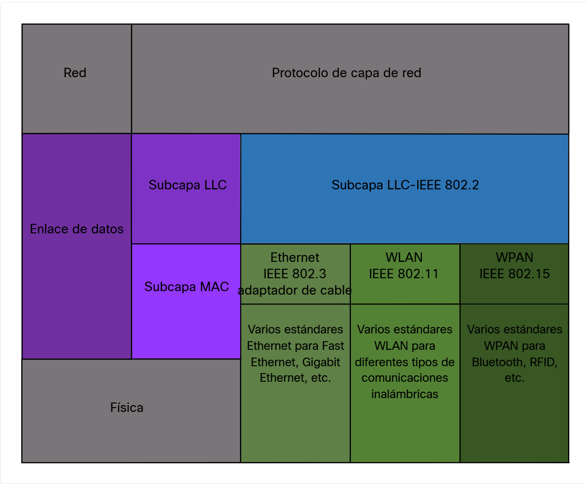

**Subcapa LLC (Logical Link Control)**

- Recibe datos de la capa de red (paquetes IPv4 o IPv6).

- Le agrega información de control de Capa 2 que ayuda a que esos datos lleguen correctamente al nodo de destino.

- Actúa como “traductor” entre los protocolos de red y el hardware de la tarjeta de red.

El LLC asegura que los paquetes de red puedan viajar usando la capa de enlace sin importar el medio.

---

**Subcapa MAC (Media Access Control)**

Es la que controla directamente la tarjeta de red (NIC) y el hardware encargado de enviar y recibir datos. Aquí ocurren funciones clave:

**Encapsulación de datos en tramas**

- **Delimitación de tramas:** 
  Marca el inicio y fin de un mensaje para no confundirlo con otros. 
  *Ejemplo:* Como los sobres de una carta, sabes dónde empieza y dónde termina lo escrito.

- **Direccionamiento:** 
  Indica quién envía y quién recibe mediante direcciones MAC. 
  *Ejemplo:* Como poner remitente y destinatario en la carta para que llegue a la persona correcta.

- **Detección de errores:** 
  Revisa si el mensaje llegó bien usando un código de verificación (CRC). 
  *Ejemplo:* Como comprobar si el sobre llegó cerrado o roto antes de leer la carta.}

La subcapa MAC controla el acceso al medio en comunicaciones compartidas (semidúplex), pero no es necesaria en dúplex completo.

---

##### Explicación del cuadro

---

**1. Capa de red (gris arriba)**

- **Qué es:** Parte del modelo OSI (Capa 3). Incluye protocolos como IPv4, IPv6.

- **Función:** Se encarga del direccionamiento lógico (IP) y del enrutamiento de paquetes entre redes distintas.

- **En el cuadro:** Aparece como “Protocolo de capa de red”, que envía datos hacia la capa de enlace.

- **Ejemplo / analogía:** Es como **la dirección de la ciudad y la calle escrita en un paquete**: *Calle 10 #25, Bogotá*. Indica a qué zona debe ir el envío.

---

**2. Capa de enlace de datos (violeta grande)**

- **Qué es:** La Capa 2 del modelo OSI.

- **Función:** Asegura la entrega de datos entre dispositivos dentro de la misma red local. Encapsula los paquetes de capa 3 en tramas y los transmite al medio físico.

- **Ejemplo / analogía:** Es como **el área logística de la empresa de mensajería**, que organiza cómo debe viajar la caja dentro de la ciudad y asegura que llegue al destinatario correcto.

---

**a. Subcapa LLC (Logical Link Control – IEEE 802.2)**

- **Qué es:** Subcapa superior de la Capa 2.

- **Función:**
  
  - Conecta la capa de red (IP) con la capa de enlace.
  
  - Indica qué protocolo de red (IPv4, IPv6, ARP, etc.) se está usando.
  
  - Permite que varios protocolos de red usen la misma tarjeta de red.

- **En el cuadro:** Se ve como “Subcapa LLC – IEEE 802.2”.

- **Ejemplo / analogía:** Es como **una etiqueta en la caja que dice qué tipo de envío es** (documento, frágil, medicamento). Así, la empresa sabe cómo manejarla aunque todos viajen por el mismo camión.

---

**b. Subcapa MAC (Media Access Control)**

- **Qué es:** Subcapa inferior de la Capa 2.

- **Función:**
  
  - Controla el acceso al medio físico (quién transmite y cuándo).
  
  - Define las direcciones MAC de origen y destino.
  
  - Se encarga de encapsular los datos en tramas con control de errores.

- **En el cuadro:** Está en color violeta y se conecta directamente con los estándares específicos de red (Ethernet, WLAN, WPAN).

- **Ejemplo / analogía:** Es como **el área de despacho en la bodega** que:
  
  - Sella la caja (delimitación de tramas).
  
  - Pone etiquetas con nombre del remitente y destinatario exacto (direcciones MAC).
  
  - Revisa que la caja no esté dañada (detección de errores).
  
  - Decide qué camión/moto sale primero si hay varios esperando (control de acceso al medio).

---

**3. Estándares IEEE 802 en la subcapa MAC (verde)**

**a. Ethernet (IEEE 802.3)**

- **Qué es:** Estándar para redes cableadas.

- **Función:** Define cómo viajan las tramas en cable (UTP, fibra óptica).

- **Incluye:** Variantes como Fast Ethernet, Gigabit Ethernet, 10 Gigabit.

- **Ejemplo / analogía:** Es como **usar camiones en carretera** para transportar cajas por rutas físicas (cables).

**b. WLAN (IEEE 802.11)**

- **Qué es:** Estándar para redes inalámbricas Wi-Fi.

- **Función:** Define cómo se transmiten las tramas por radiofrecuencia.

- **Incluye:** 802.11a/b/g/n/ac/ax (Wi-Fi 5, Wi-Fi 6).

- **Ejemplo / analogía:** Es como **usar motos con radio o drones** que llevan los paquetes por el aire sin necesidad de carreteras.

**c. WPAN (IEEE 802.15)**

- **Qué es:** Estándar para redes personales inalámbricas de corto alcance.

- **Función:** Usado en dispositivos de baja potencia y corto alcance.

- **Incluye:** Bluetooth, ZigBee, RFID, etc.

- **Ejemplo / analogía:** Es como **un mensajero a pie entregando paquetes dentro de la misma cuadra o edificio**, ideal para distancias muy cortas.

---

**4. Capa física (gris abajo)**

- **Qué es:** La Capa 1 del modelo OSI.

- **Función:** Transmite los bits en forma de señales eléctricas, de radio o de luz a través del medio (cable, aire, fibra).

- **En el cuadro:** Es la base donde se apoyan Ethernet, WLAN y WPAN.

- **Ejemplo / analogía:** Es como **la carretera, la calle o el aire por donde circula el mensajero**:
  
  - Carretera asfaltada → cable UTP.
  
  - Autopista rápida → fibra óptica.
  
  - Aire libre → Wi-Fi o Bluetooth.

---

#### Provisión de acceso a los medios

Cuando un paquete IP viaja desde un host local (tu PC, por ejemplo) hasta un host remoto (un servidor en internet), pasa por varios entornos de red distintos. 
Cada entorno puede ser LAN, WAN, enlaces seriales, inalámbricos, fibra, etc., y cada uno usa su propio método de transmisión en la Capa 2 (enlace de datos).

Los routers son los encargados de que el paquete pueda atravesar todos esos entornos, porque:

1. Reciben una trama desde un medio (ej: Ethernet).

2. Desencapsulan esa trama para extraer el paquete IP.

3. Encapsulan el paquete en una nueva trama, pero esta vez adecuada al siguiente medio (ej: Serial, Wi-Fi).

4. Reenvía la nueva trama al siguiente enlace de red.

Este proceso se repite en cada salto (cada router que atraviesa el paquete).

*Ejemplo:*

Imagina que quieres enviar un regalo a un amigo que vive en otro país.

- En tu barrio, lo llevas en una bolsa plástica (LAN – trama Ethernet).

- En la terminal, cambian la bolsa por una caja de cartón (WAN – trama serial).

- Al llegar a otro país, la vuelven a cambiar por un sobre de burbuja (Wi-Fi, fibra, etc.).

- En cada punto, alguien (el router) abre el empaque, saca el regalo (el paquete IP), y lo vuelve a empacar según el transporte siguiente.

El regalo nunca cambia (el paquete IP siempre es el mismo), lo único que cambia es el empaque (trama de Capa 2) según el medio de transporte.

*La capa de enlace de datos es responsable de controlar la transferencia de tramas en todos los medios.*

#### Estándares de la capa de enlace de datos

El IETF (Internet Engineering Task Force) se encarga de protocolos como IP, TCP, HTTP, etc., que son capas superiores (red, transporte, aplicación). Pero no regula cómo viajan los bits por el cable o por el aire.

Ese trabajo lo hacen organismos especializados en normas de hardware y transmisión:

- El **IEEE** define cómo debe funcionar Ethernet y Wi-Fi.

- El **ITU** define normas para la telefonía y transmisión global.

- El **ISO** define marcos de referencia internacionales (ejemplo: OSI).

- El **ANSI** establece normas técnicas para EE. UU. que luego influyen en estándares globales.

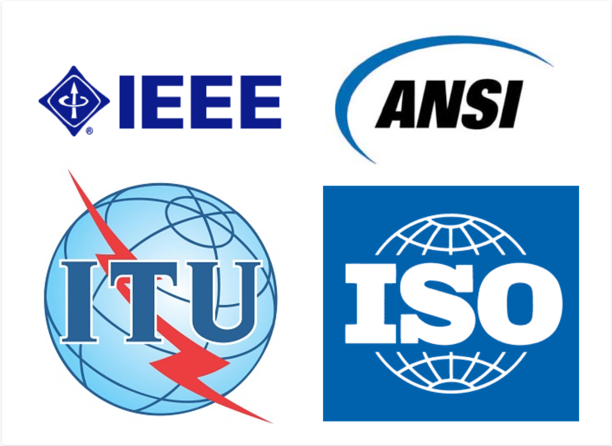

---

### Topologías

Es la configuración o relación de los dispositivos y cómo están interconectados. Nos ayuda a entender cómo fluyen los datos entre dispositivos.

Se dividen en dos tipos principales:

 **Topología física**

- Muestra cómo están conectados físicamente los dispositivos finales (PC, impresoras) y los dispositivos intermedios (switch's, routers, APs).

- También puede incluir la ubicación exacta de cada dispositivo (número de habitación, posición en un rack).

- Ejemplos típicos:
  
  - **Punto a punto:** Conexión directa entre dos dispositivos.
  
  - **Estrella:** Todos los dispositivos se conectan a un nodo central (switch o hub).

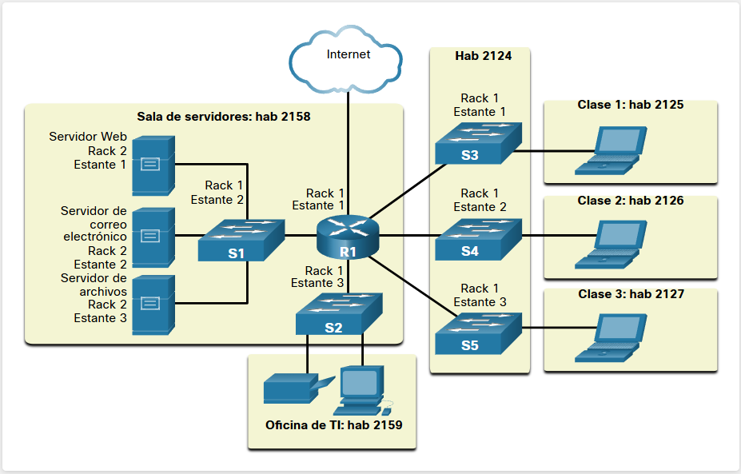

 **Topología lógica**

- Describe cómo se transfieren los datos de un nodo a otro, sin importar la conexión física.

- Define conexiones virtuales mediante interfaces y direcciones IP.

- Determina el tipo de tramas y cómo se controla el acceso al medio.

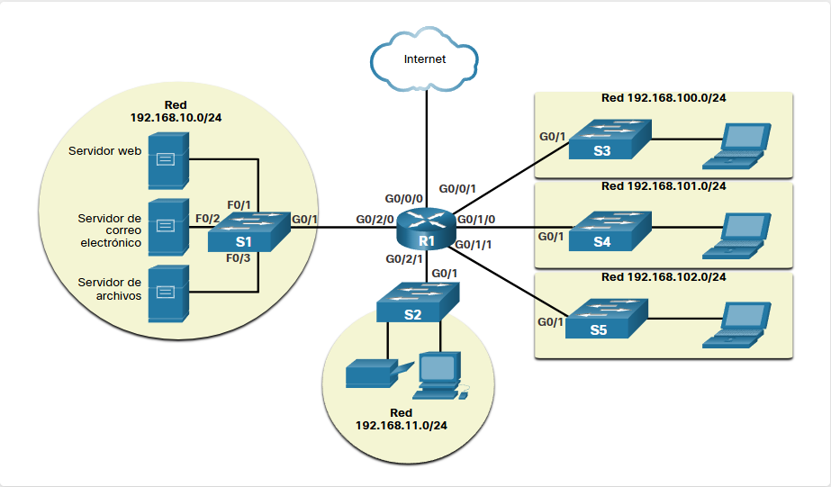

**Relación con la capa de enlace de datos**

- La capa de enlace de datos trabaja con la topología lógica, porque es la responsable de controlar el acceso al medio.

- Esto significa que dependiendo de la topología lógica, se usarán diferentes tipos de tramas y mecanismos de control (como CSMA/CD en Ethernet o token passing en redes tipo anillo).

#### Topologías de WAN

**1. Punto a punto (Point-to-Point)**

- Conecta directamente dos nodos de red.

- Se usa para enlaces dedicados entre sucursales o entre un cliente y un proveedor de servicios.

- Ventaja: Simple y confiable.

- Desventaja: No es escalable; si quieres agregar más nodos, se necesitan nuevos enlaces directos para cada conexión.

- Ejemplo: Un enlace dedicado entre dos oficinas.

**Hub and Spoke (En estrella)**

- Un nodo central (hub) se conecta a varios nodos secundarios (spokes).

- Todo el tráfico entre nodos secundarios pasa por el hub.

- Ventaja: Más fácil de administrar y expandir.

- Desventaja: El hub es un punto único de fallo.

- Ejemplo: Red corporativa con una oficina central y varias sucursales.

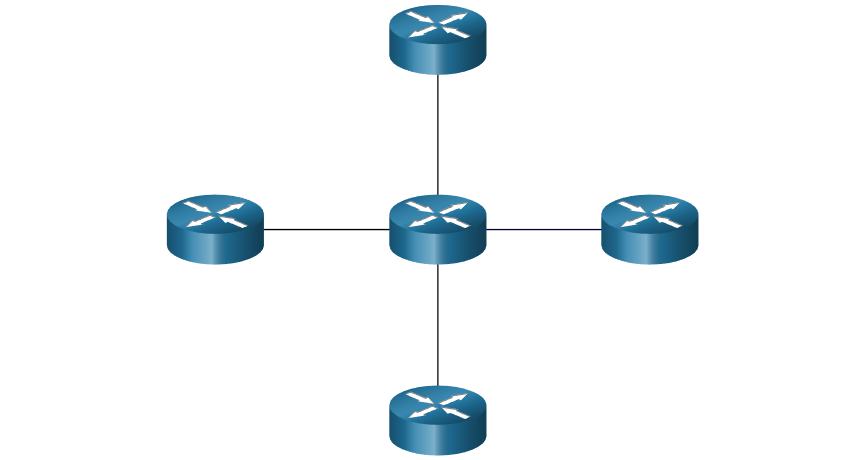

**Malla (Mesh)**

- Cada nodo puede conectarse directamente con todos los demás nodos.

- Alta redundancia y tolerancia a fallos: si un enlace falla, los datos pueden tomar otra ruta.

- Ventaja: Muy confiable y flexible.

- Desventaja: Costosa de implementar por la cantidad de enlaces necesarios.

- Ejemplo: Interconexión de datacenters críticos.

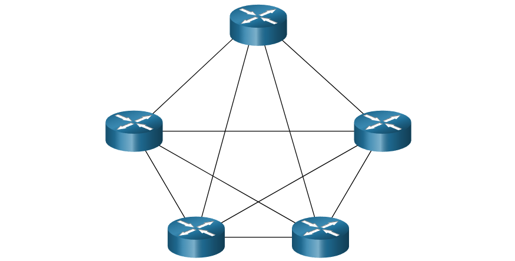

Un híbrido es una variación o combinación de cualquier topología. Por ejemplo, una malla parcial es una topología híbrida en la que algunos, pero no todos, los dispositivos finales están interconectados.

#### Topología WAN de punto a punto

En una topología punto a punto, dos nodos están conectados directamente y no necesitan compartir el medio con otros dispositivos. Esto simplifica los protocolos de enlace de datos, ya que todas las tramas enviadas se reciben únicamente en el nodo destino. Cada nodo coloca las tramas en el medio y el otro nodo las recibe directamente, lo que hace que la comunicación sea simple y eficiente.

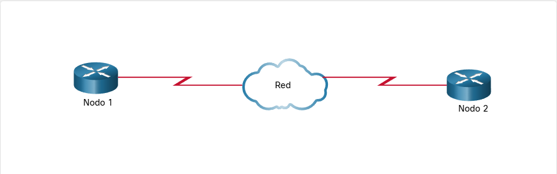

Aunque los nodos puedan estar conectados a través de varios dispositivos físicos, la topología lógica puede seguir siendo punto a punto, porque cada nodo se comunica directamente con el otro a nivel de tramas. En Ethernet, incluso en un enlace punto a punto, cada nodo debe verificar si la trama entrante le corresponde.

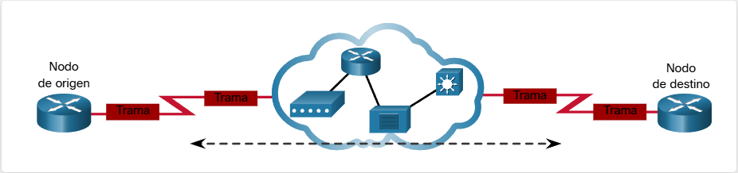

#### Topologías de LAN

**LAN multiacceso modernas**

- En las LAN actuales, los dispositivos finales (PC, impresoras, routers) generalmente se conectan mediante topologías estrella o estrella extendida.
  
  - **Estrella:** Todos los dispositivos se conectan a un dispositivo central, normalmente un switch Ethernet.
  
  - **Estrella extendida:** Conecta varios switch's entre sí, formando una red más grande y escalable.

- **Ventajas:**
  
  - Fácil de instalar.
  
  - Escalable: Se pueden agregar o quitar dispositivos sin afectar a los demás.
  
  - Resolución de problemas más sencilla.

- **Nota:** En los inicios, se usaban hubs en lugar de switch's, pero funcionaban de manera similar.

- **Excepción:** Si solo hay dos dispositivos conectados (como dos routers), la LAN funciona como punto a punto.

---

**LAN heredadas**

Antes de las LAN modernas basadas en switches, existían otras topologías:

**a) Bus**

- Todos los dispositivos se conectan en una línea continua y el cable termina en cada extremo.

- No requiere dispositivos centrales (switches o hubs).

- Se usaba mucho en Ethernet con cable coaxial, porque era barato y fácil de instalar.

- Desventaja: Difícil de escalar y solucionar problemas si el cable falla.
  
  **b) Anillo**

- Cada dispositivo se conecta a su vecino, formando un circuito cerrado.

- No necesita terminadores como en el bus.

- Ejemplos: **Token Ring** y **FDDI** (redes de fibra heredadas).

- Las tramas circulan en una dirección hasta llegar al destino.

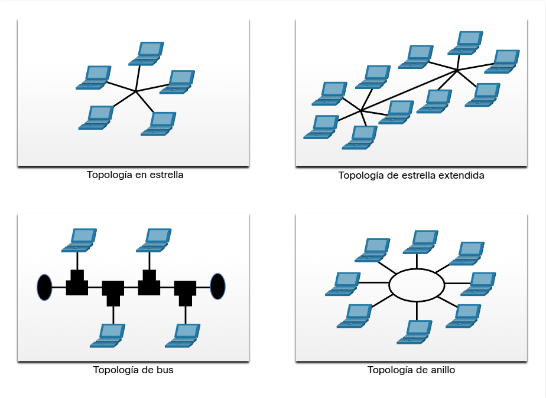

#### Comunicación Dúplex completo y semidúplex

La comunicación dúplex indica cómo se transmiten los datos entre dos dispositivos:

- **Semidúplex:** Los dispositivos pueden enviar o recibir, pero no al mismo tiempo. Se usa en topologías de bus heredadas y algunas WLAN.

- **Dúplex completo:** Los dispositivos pueden enviar y recibir simultáneamente, como ocurre en switch's Ethernet modernos.

#### Métodos de control de acceso

**Redes de acceso múltiple (multiacceso)**

- Son redes donde dos o más dispositivos pueden intentar usar el medio al mismo tiempo (ej.: LAN Ethernet, WLAN).

- Para evitar conflictos, se usan métodos de control de acceso al medio.

**1. Acceso por contienda (basado en contención)**

- Todos los nodos compiten por el uso del medio y normalmente operan en semidúplex.

- Solo un dispositivo puede transmitir a la vez; si varios transmiten, ocurre un conflicto (colisión) que debe resolverse.

- Ejemplos:
  
  - CSMA/CD (Acceso Múltiple por Detección de Portadora con Detección de Colisiones) - Ethernet de bus heredada, detecta colisiones y retransmite.
  
  - CSMA/CA (Acceso Múltiple por Detección de Portadora con Prevención de Colisiones) - WLAN, evita colisiones antes de transmitir.

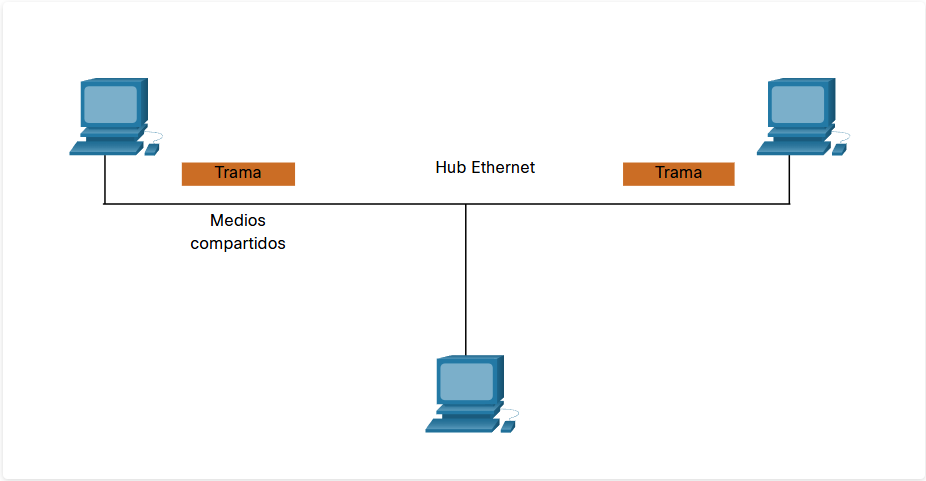

**2. Acceso controlado**

- Cada nodo tiene un turno asignado para usar el medio, evitando colisiones.

- Es determinista, pero menos eficiente, porque un dispositivo debe esperar su turno.

- Ejemplos clásicos:
  
  - **Token Ring** (heredado)
  
  - **ARCNET** (heredado)

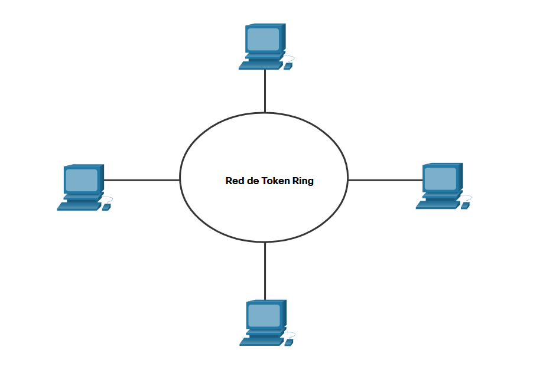

*Nota: Las redes Ethernet modernas en dúplex completo ya no requieren métodos de acceso, porque no existen colisiones en el enlace.*

#### Acceso por contención - CSMA/CD

Las redes de acceso por contención funcionan en semidúplex, es decir, solo un dispositivo puede enviar o recibir a la vez. Ejemplos:

- LAN inalámbrica → **CSMA/CA**

- LAN Ethernet de bus heredada → **CSMA/CD**

- LAN Ethernet heredada con hub → **CSMA/CD**

Si dos dispositivos transmiten al mismo tiempo, ocurre una colisión: los datos se dañan y deben reenviarse. En CSMA/CD, las tarjetas de red detectan la colisión y controlan la retransmisión.

**Proceso de CSMA/CD en LAN Ethernet heredadas que utilizan un hub**

- Cuando **PC1** quiere enviar una trama a **PC3**, su tarjeta de red (**NIC**) primero verifica si el medio está libre. Si no detecta señales de otros dispositivos, asume que la red está disponible y transmite la trama.

- El hub Ethernet recibe la trama de un dispositivo y la regenera para enviarla a todos los demás puertos. Por eso también se le llama repetidor multipuerto.

- Cuando el hub envía la trama, todos los dispositivos conectados la reciben, pero solo la PC3, que coincide con la dirección destino de la trama, la acepta y copia; los demás dispositivos la ignoran.

#### Acceso por contención - CSMA/CA

CSMA/CA, usado en WLAN IEEE 802.11, verifica si el medio está libre antes de transmitir y evita colisiones en lugar de detectarlas. Cada transmisión indica la duración del uso del medio, y los demás dispositivos esperan ese tiempo antes de enviar, asegurando que no haya interferencias.

Cuando un dispositivo inalámbrico envía una trama 802.11, el receptor envía un acuso de recibo para confirmar que la trama llegó correctamente.

Las redes de acceso por contención (como LAN con hubs o WLAN) no escalan bien cuando muchos dispositivos usan el medio al mismo tiempo.

*Nota: Las LAN Ethernet modernas con switch's no usan contención, porque el switch y las NIC funcionan en dúplex completo, evitando colisiones.*

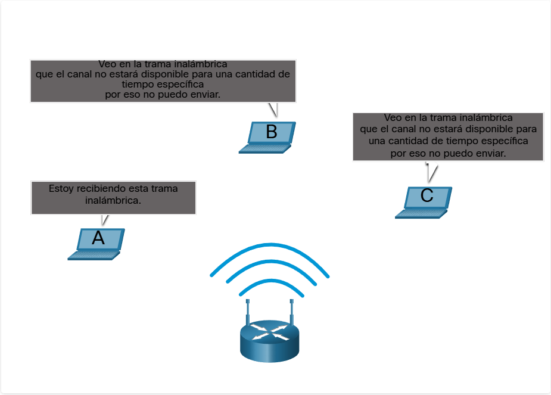

---

### Trama de enlace de datos

- La capa de enlace de datos prepara los datos (por ejemplo, un paquete IPv4 o IPv6) para enviarlos por la red local.

- Lo hace encapsulando los datos en una trama, que tiene tres partes básicas:
  
  1. **Encabezado (Header):** Información de control, como direcciones de origen y destino.
  
  2. **Datos (Payload):** El paquete que se va a transportar.
  
  3. **Tráiler (Trailer):** Información adicional de control, como verificación de errores (CRC).

**Importancia del protocolo**

- Cada protocolo de enlace de datos define la estructura del encabezado y del tráiler, según el tipo de red y medio.

- No existe un formato único de trama que funcione para todos los medios.

- Redes diferentes necesitan diferente cantidad de información de control:
  
  - **Ethernet:** Menos información de control.
  
  - **WLAN:** Más información para evitar colisiones y garantizar entrega, especialmente en entornos frágiles.

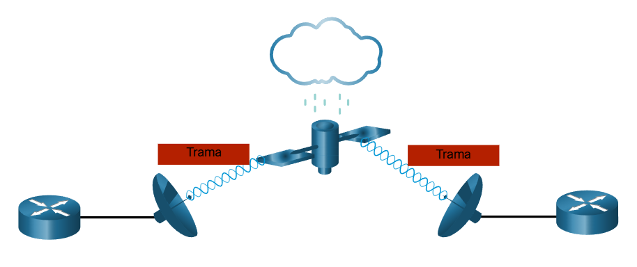

#### Campos de tramas

La trama se divide en tres bloques:

**Encabezado (Header)**

Incluye campos de control y direccionamiento:

1. **Inicio de trama**: Indica el límite inicial de la trama. Permite al receptor reconocer dónde empieza la información válida.

2. **Direccionamiento**: Contiene las direcciones de origen y destino, identificando los nodos que envían y reciben la trama.

3. **Tipo**: Especifica el protocolo de capa 3 contenido en los datos (por ejemplo, IP, ARP).

4. **Control**: Incluye servicios especiales, como calidad de servicio (QoS) o prioridades de tráfico, útil en voz o video.

**Datos (Payload)**

- Contiene el paquete completo de capa 3, incluyendo:
  
  - Encabezado del paquete IP
  
  - Datos del segmento o datagrama

**Tráiler (Trailer)**

- Campos usados para verificar la integridad de los datos:
  
  1. **Detección de errores**: Incluye un resumen lógico o matemático de la trama para comprobar que los datos llegaron correctamente.
  
  2. **Detención de trama**: Indica el final de la trama, delimitando dónde termina la información válida.

**Detección de errores (CRC / FCS)**

- La capa de enlace de datos agrega un valor de comprobación de redundancia cíclica (CRC) en el campo FCS (Frame Check Sequence) del tráiler.

- Este valor es un resumen matemático de todos los bits de la trama.

- El receptor calcula nuevamente el CRC y lo compara con el FCS recibido.
  
  - Si coinciden → la trama llegó sin errores.
  
  - Si no coinciden → la trama se considera corrupta y se descarta.

#### Direcciones de Capa 2

La capa de enlace de datos se encarga de transportar tramas dentro de una red local y utiliza direcciones físicas (direcciones de Capa 2) para identificar los dispositivos de origen y destino. Estas direcciones son únicas por dispositivo, no jerárquicas, y permanecen constantes aunque el dispositivo se mueva a otra red. El encabezado de la trama contiene estas direcciones, permitiendo que la tarjeta de red (NIC) determine rápidamente si la trama le corresponde.

A diferencia de las direcciones lógicas de Capa 3 (IP), que indican la ubicación en la red, las direcciones de Capa 2 solo permiten la comunicación dentro del mismo medio local. Cada vez que un paquete IP atraviesa routers, se encapsula en nuevas tramas de enlace de datos con las direcciones físicas correspondientes a los nodos que envían y reciben la trama en cada salto.

**Paso a paso del flujo**

**1. Host a Router**

- El host de origen quiere enviar un paquete IP a un servidor.

- Ese paquete IP es de Capa 3, contiene la dirección IP de origen y destino.

- Antes de enviarlo al medio físico, el host lo encapsula en una trama de Capa 2.

- La trama de Capa 2 contiene:
  
  - **Dirección de origen**: La MAC del host.
  
  - **Dirección de destino**: La MAC del router R1 (el primer salto).

- Así, la NIC del host sabe a quién enviar físicamente la trama, y R1 sabe que la trama le corresponde a él.

**2. Router a Router**

- R1 recibe la trama, verifica que la MAC de destino coincide con la suya.

- R1 extrae el paquete IP de Capa 3 y determina a dónde debe enviarlo según la IP de destino.

- R1 encapsula el mismo paquete IP en una nueva trama de Capa 2 para enviarlo al siguiente router (R2):
  
  - **Dirección de origen**: MAC de R1 (interfaz de salida).
  
  - **Dirección de destino**: MAC de R2 (interfaz del siguiente router).

- La dirección IP de Capa 3 no cambia, solo las direcciones físicas de Capa 2 se actualizan en cada salto.

**3. Router a Host**

- R2 recibe la trama, verifica la MAC de destino y acepta la trama.

- Extrae el paquete IP y verifica la dirección IP de destino (del servidor).

- R2 encapsula el paquete en una nueva trama de Capa 2 para enviarlo al servidor:
  
  - **Dirección de origen**: MAC de R2 (interfaz de salida hacia el servidor).
  
  - **Dirección de destino**: MAC del servidor.

- Así, el servidor recibe la trama que le corresponde y puede extraer el paquete IP.

La dirección de Capa 2 (enlace de datos) solo sirve para la entrega local dentro de la misma red; no tiene significado fuera de ese segmento. En cambio, las direcciones de Capa 3 (IP) permanecen con el paquete y permiten que llegue al host de destino sin importar la cantidad de saltos.

#### Tramas LAN y WAN

**Protocolos de Capa 2 y su función**

La Capa de Enlace de Datos transmite tramas entre dispositivos en el mismo medio, encargándose de:

- Encapsular paquetes IP en tramas.

- Controlar el acceso al medio.

- Gestionar direcciones físicas (MAC).

El protocolo usado depende de la topología y del medio físico.

**LAN vs. WAN**

- **LAN**: redes locales cableadas o inalámbricas; protocolos comunes **Ethernet** y 802.11; alta densidad de usuarios y ancho de banda.

- **WAN**: cubre grandes distancias; protocolos tradicionales PPP, HDLC, Frame Relay, ATM, X.25; hoy en día muchas usan Ethernet; ancho de banda menor y mayor costo.

**Relación con Capa 3**

Los protocolos de Capa 2 funcionan con direcciones IP de Capa 3. La elección del protocolo depende de la topología, medios, tamaño de la red y servicios requeridos. Los dispositivos que implementan Capa 2 incluyen NICs, routers y switch's.

**Control de acceso**

- **Ethernet:** CSMA/CD

- **WLAN:** CSMA/CA

- Otros protocolos usan métodos propios según la tecnología.

| Tipo de red     | Protocolos                        | Características                                 |
| --------------- | --------------------------------- | ----------------------------------------------- |
| LAN cableada    | Ethernet                          | Alta velocidad, económico, uso masivo           |
| LAN inalámbrica | 802.11                            | Medio compartido, CSMA/CA                       |
| WAN tradicional | PPP, HDLC, Frame Relay, ATM, X.25 | Punto a punto, menor ancho de banda, costo alto |
| WAN moderna     | Ethernet                          | Estandarización y soporte IP                    |
