# Módulo 7: Switching Ethernet

---

## Contenido

- **Trama de Ethernet:** Explica la forma en que las subcapas de Ethernet se relacionan con los campos de trama.

- **Dirección MAC de Ethernet:** Describe la dirección MAC de Ethernet.

- **La tabla de direcciones MAC:** Explica la forma en que un switch arma su tabla de direcciones MAC y reenvía las tramas.

- **Velociodades y métodos de reenvío del switch:** Describe los métodos de reenvío  de switch y la configuración de puertos disponibles para los puertos de switch en la capa 2 puertos de switch.

---

### Tramas de Ethernet

**Ethernet** es tecnología LAN por cable (pares trenzados, fibra óptica, coaxial).

Como alternativas tiene la tecnología LAN actual es WLAN (inalámbrica).

Las capas en las que opera en enlace de datos (sublayer MAC) y física.

Sus estándares son IEEE 802.2 y 802.3.

**Velocidades soportadas**:

- 10 Mbps

- 100 Mbps

- 1 Gbps

- 10 Gbps

- 40 Gbps

- 100 Gbps

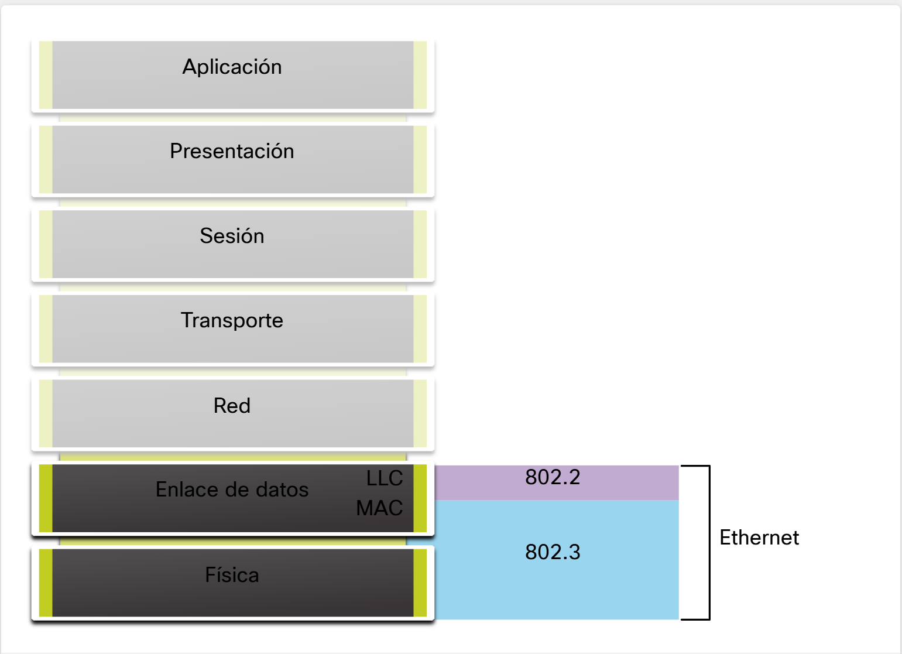

Capa de enlace de datos (IEEE 802) se divide en dos subcapas:

- **LLC (Logical Link Control, IEEE 802.2):**
  
  - Comunica capas superiores ↔ hardware.
  
  - Identifica el protocolo de red usado (ej: IPv4, IPv6).
  
  - Permite que varios protocolos de Capa 3 compartan la misma interfaz.

- **MAC (Media Access Control, IEEE 802.3 / 802.11 / 802.15):**
  
  - Implementada en hardware.
  
  - Encapsula datos y controla acceso al medio.
  
  - Maneja direccionamiento en capa de enlace y se integra con la capa física.

El LLC conecta software y protocolos de red con el hardware, mientras que MAC gestiona el acceso al medio y la entrega física de las tramas.

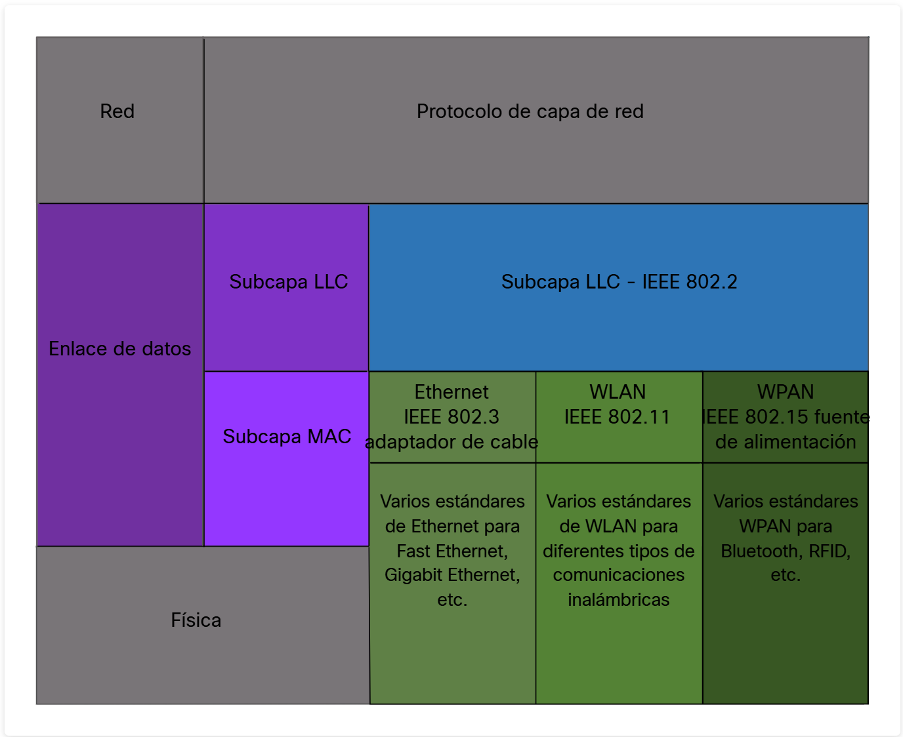

#### Subcapa MAC

La subcapa MAC (IEEE 802.3) cumple dos funciones principales:

1. **Encapsulación de datos**:
   
   - Crea la trama Ethernet (cabecera + datos + verificación).
   
   - Añade direcciones MAC de origen y destino.
   
   - Incluye un FCS para detección de errores.

2. **Acceso a los medios**:
   
   - Define cómo los dispositivos usan el medio físico (cobre, fibra, etc.).
   
   - Antes usaba CSMA/CD, hoy se usan enlaces conmutados sin colisiones.

La subcapa MAC organiza los datos en tramas y controla cómo se accede al medio de transmisión.

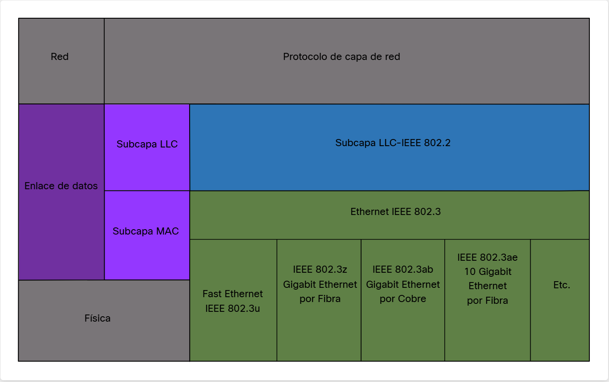

**Ethernet heredado (antiguo)**

- **Topología**: Bus o con hubs → medio compartido.

- **Modo**: Half-dúplex (solo un dispositivo transmite a la vez).

- **Acceso**: Usa CSMA/CD (Carrier Sense Multiple Access with Collision Detection).
  
  - Escucha antes de transmitir.
  
  - Si dos dispositivos transmiten a la vez → ocurre una colisión.
  
  - Se detecta la colisión y se aplica un algoritmo de retroceso para reintentar.

- Ventaja: Permitía que varios equipos compartieran un mismo cable.

- Desventaja: Colisiones frecuentes → menor eficiencia.

**Ethernet actual (moderno)**

- **Topología**: Con switches.

- **Modo**: Full-dúplex (ambos extremos transmiten y reciben al mismo tiempo).

- **Acceso**: No necesita CSMA/CD porque cada enlace es punto a punto y no hay colisiones.

- Resultado: Comunicaciones más rápidas, estables y eficientes.

##### CONCEPTOS

**CSMA/CD (Carrier Sense Multiple Access with Collision Detection)** Acceso múltiple por detección de portadora con detección de colisiones.

- **Contexto:** Usado principalmente en Ethernet (cableado).

- **Funcionamiento:**
  
  1. Un dispositivo escucha el canal antes de transmitir (Carrier Sense).
  
  2. Si el canal está libre, transmite (Multiple Access).
  
  3. Mientras transmite, sigue escuchando para detectar si hay colisiones (Collision Detection).
  
  4. Si detecta una colisión, detiene la transmisión, envía una señal de colisión (jam signal), y espera un tiempo aleatorio antes de volver a intentarlo (backoff exponencial).

En pocas palabras, transmite y detecta colisiones para reintentar.

**CSMA/CA (Carrier Sense Multiple Access with Collision Avoidance)** Acceso múltiple por detección de portadora con evitación de colisiones.

- **Contexto:** Usado en Wi-Fi (IEEE 802.11).

- **Funcionamiento:**
  
  1. Un dispositivo escucha el canal antes de transmitir.
  
  2. Si está libre, espera un tiempo aleatorio (backoff) antes de transmitir, para reducir la probabilidad de colisiones.
  
  3. Puede usar mecanismos de solicitud y confirmación (RTS/CTS: Request to Send / Clear to Send) para reservar el canal y evitar choques.
  
  4. Luego transmite los datos y espera confirmación (ACK).

En pocas palabras, transmite intentando evitar colisiones desde antes de enviar.

#### Campos de trama de Ethernet

El rango válido de una trama Ethernet es 64–1518 bytes; fuera de ese rango se descarta automáticamente.

- Una trama Ethernet mide entre 64 y 1518 bytes (sin contar el preámbulo).

- Menos de 64 bytes → se considera trama corta o fragmento de colisión y se descarta.

- Más de 1518 bytes → se considera trama jumbo; muchos switch's y NIC modernos la soportan.

- Tramas fuera de este rango se descartan por ser inválidas (colisiones o ruido).

En Data tambien viene la información de pisos superiores, no solo los datos.

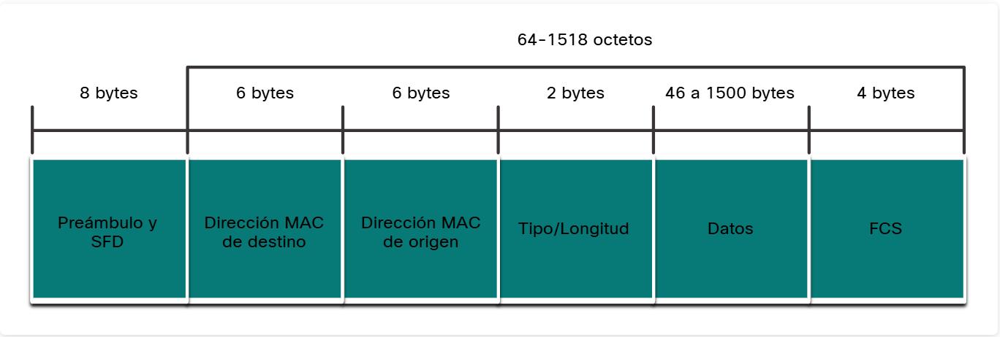

| **Campo**                                   | **Descripción**                                                                                                                                                     |
| ------------------------------------------- | ------------------------------------------------------------------------------------------------------------------------------------------------------------------- |
| **Preámbulo y Delimitador de inicio (8 B)** | Sirve para sincronizar la comunicación entre emisor y receptor. Indica el inicio de la trama.                                                                       |
| **Dirección MAC de destino (6 B)**          | Identifica el dispositivo receptor. Puede ser unicast (uno), multicast (grupo) o broadcast (todos).                                                                 |
| **Dirección MAC de origen (6 B)**           | Identifica la NIC del emisor, es decir, quién envía la trama.                                                                                                       |
| **Tipo/Longitud (2 B)**                     | Indica qué protocolo de capa superior está encapsulado (IPv4=0x800, IPv6=0x86DD, ARP=0x806). Tambien puede ser denominado este compo como EtherType, Type o Lenght. |
| **Datos (46 - 1500 B)**                     | Contiene la información real (ej. un paquete IPv4). Si es pequeño, se agrega relleno (pad) hasta llegar al mínimo de 64 B de trama.                                 |
| **Secuencia de verificación FCS (4 B)**     | Campo de detección de errores usando CRC. Si los cálculos no coinciden, la trama se descarta.                                                                       |

---

### Dirección MAC de Ethernet

IPv4 se representa en decimal y binario, en cambio la IPv6 y direcciones MAC se representan en hexadecimal. En Hexadecimal usa dígitos 0–9 y letras A–F (16 símbolos), en relación, la mejor forma de expresarlo será 1 dígito hex = 4 bits binarios.

**Dirección MAC → 48 bits → 6 Bytes (6 bloques) → expresada con 12 dígitos hexadecimales.**

Direcciones posibles: 2^48 ≈ 281 billones.

También existe una variante de **64 bits (8 bytes)** llamada **EUI-64**, pero no es la que se usa normalmente en Ethernet/Wi-Fi.

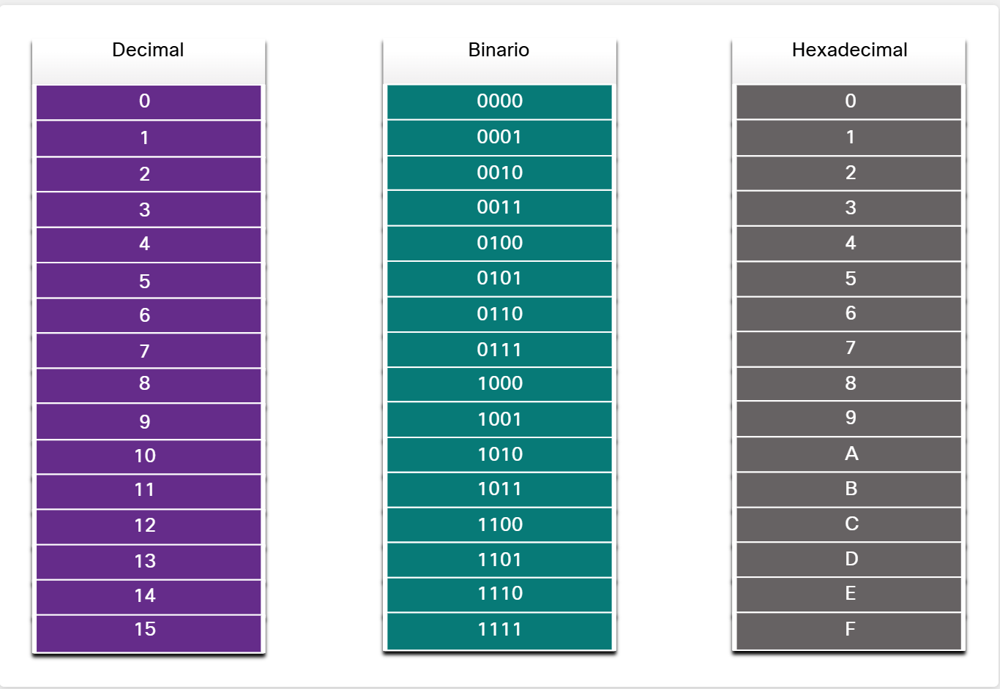

Un byte puede representarse como dos dígitos hexadecimales.

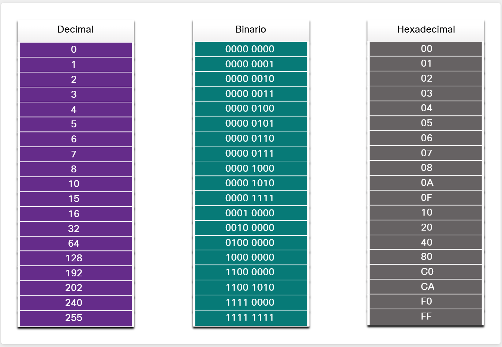

En hexadecimal se muestran los ceros iniciales para completar el byte (ej: `00001010` → `0A`). Sus formas  más comunes de escribir hex son:

- `0x73`

- `73H`

- `73₁₆`

Para convertir entre decimal y hex, lo más práctico es pasar primero por binario.

#### Dirección MAC y hexadecimal

En Ethernet, cada dispositivo tiene una dirección MAC única que identifica su tarjeta de red (NIC). Su mejor representación seria:

Una dirección MAC = 48 bits = 6 bytes = 12 dígitos hexadecimales.

Esta dirección sirve para identificar origen y destino en la capa de enlace de datos (OSI). Siendo el “número de identidad” físico de cada tarjeta de red en una LAN.

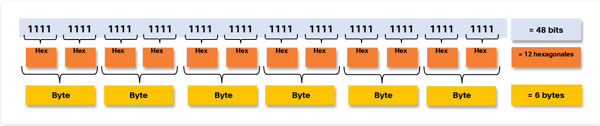

Cada MAC debe ser única, con el IEEE se da a cada fabricante un código de 24 bits (3 bytes) llamado OUI. El fabricante usa ese OUI como los primeros 6 dígitos hex de la MAC, con esto, los últimos 6 dígitos los asigna el fabricante para identificar cada dispositivo, o sea, la MAC se compone de OUI (fabricante) + número único del dispositivo.

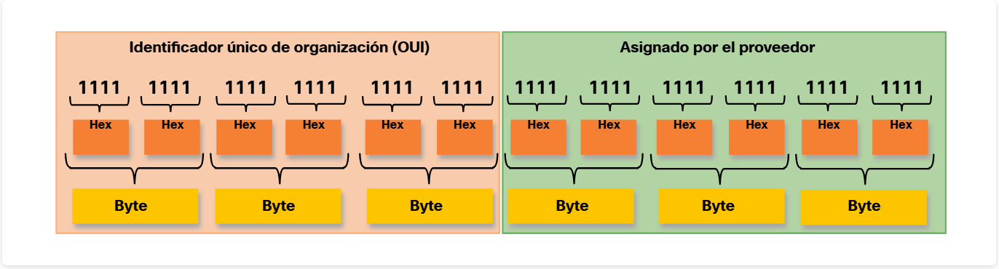

Cada fabricante (ej. **Cisco**) recibe un OUI del IEEE.

- Ejemplo: `00-60-2F` = OUI de Cisco.

Luego el fabricante añade un código propio de otros 3 bytes para diferenciar cada dispositivo.

- Ejemplo: `3A-07-BC`.

- Así se forma la MAC completa: `00-60-2F-3A-07-BC`.

El fabricante debe evitar duplicados, pero a veces ocurren por:

- **Errores de fabricación**.

- **Problemas en máquinas virtuales**.

- **Cambios manuales con software**.

Si pasa, la solución es cambiar la MAC (nueva tarjeta de red o ajuste en software).

#### Procesamiento de tramas

- Cada tarjeta de red (NIC) viene con una dirección física única llamada MAC (Media Access Control).

- También se le dice BIA (Burned-In Address) porque está grabada permanentemente en el chip ROM de la tarjeta.

- Ejemplo: `00:1A:2B:3C:4D:5E`.

**Cómo funciona en el arranque**

- Cuando el computador enciende, la tarjeta de red copia su dirección MAC desde la ROM hacia la RAM, para que el sistema operativo la use.

- Es como si la tarjeta dijera: *“Esta es mi identificación, guárdala para comunicarte en la red”*.

**Origen y destino en una trama Ethernet**

Cuando un dispositivo envía datos en Ethernet:

- En el encabezado de la trama se colocan dos direcciones:
  
  - **MAC de origen** → la de la NIC del dispositivo que envía.
  
  - **MAC de destino** → la de la NIC del dispositivo al que va dirigido.

Ejemplo: 
PC1 (MAC `AA:BB:CC:DD:EE:01`) envía un mensaje a PC2 (MAC `AA:BB:CC:DD:EE:02`). 
La trama Ethernet llevará:

- **Origen:** `AA:BB:CC:DD:EE:01`

- **Destino:** `AA:BB:CC:DD:EE:02`.

**Cambio de dirección MAC**

Aunque la dirección está grabada, los sistemas modernos permiten modificarla temporalmente en software.

- Esto se usa, por ejemplo, para conectarse a una red que filtra dispositivos por MAC.

- Pero por eso el filtrado por MAC no es totalmente seguro, ya que se puede suplantar.

Al final la NIC revisa la MAC de destino de cada trama recibida.

- Si coincide con su propia MAC → la acepta y la pasa a las capas OSI.

- Si no coincide → la descarta.

- **Excepciones:** También acepta tramas de:
  
  - **Broadcast** (`FF:FF:FF:FF:FF:FF`) → para todos.
  
  - **Multicast** → solo si el host es miembro del grupo.

- Todo dispositivo en Ethernet (PC, servidor, impresora, móvil, router) tiene NIC y dirección MAC.

#### Dirección MAC de unicast

En Ethernet, se utilizan diferentes direcciones MAC para las comunicaciones de unicast, broadcast y multicast de capa 2.
Una dirección MAC de unicast es la dirección única que se utiliza cuando se envía una trama desde un único dispositivo de transmisión a un único dispositivo de destino.

##### Paso a paso de como es el flujo de unicast

1. **Unicast en IP y MAC**
- Cuando un host quiere comunicarse con otro (ej: `192.168.1.5` → `192.168.1.200`), se usan dos direcciones:
  
  - **IP destino (unicast)** → va en el encabezado del paquete IP.
  
  - **MAC destino (unicast)** → va en el encabezado de la trama Ethernet.

- Ambas direcciones (IP + MAC) trabajan juntas para que los datos lleguen al host correcto.
2. **Cómo se obtiene la MAC destino**
- Si el host solo conoce la IP, necesita averiguar la MAC correspondiente:
  
  - En **IPv4** → usa ARP (Address Resolution Protocol).
  
  - En **IPv6** → usa ND (Neighbor Discovery).
2. **Regla importante**
- La MAC de origen siempre es unicast, porque identifica de manera única al dispositivo que envía la trama.

#### Dirección MAC broadcast

El Broadcast en Ethernet es la trama que va a todos los dispositivos de la LAN con su dirección MAC destino: **FF:FF:FF:FF:FF:FF** mientras el switch la envía por todos los puertos, menos por donde llegó. El router no la reenvía (se queda en la red local) y en IPv4, la dirección de destino con todos los bits en 1 indica “para todos en la red”.

###### Paso a paso de como es el flujo de broadcast

1. Host origen genera el mensaje quiere que todos lo reciban.

2. Encapsulación:
   
   - IP destino = broadcast (ej. `192.168.1.255`).
   
   - MAC destino = `FF:FF:FF:FF:FF:FF`.

3. Switch recibe la trama y la inunda a todos los puertos, excepto por donde entró.

4. Todos los hosts de la LAN reciben la trama y la procesan porque la MAC es broadcast.

5. Finalmente el Router no reenvía porque el broadcast queda limitado al dominio de broadcast (la red local).

#### Dirección MAC de multicast

Una trama multicast la reciben solo los dispositivos miembros de un grupo, no todos como en broadcast.

**Direcciones MAC destino:**

- `01-00-5E` → para multicast IPv4.

- `33-33` → para multicast IPv6.

También hay direcciones multicast reservadas para otros protocolos (ej. **STP**, **LLDP**).

Switch's: Por defecto la envían a todos los puertos (excepto el de origen), a menos que estén configurados con snooping de multicast.

Routers: No reenvían multicast, salvo que tengan activado el enrutamiento de multicast.

**Direcciones IP de multicast:**

- IPv4 → rango `224.0.0.0 – 239.255.255.255`.

- IPv6 → rango `ff00::/8`.

La IP multicast siempre se traduce a una MAC multicast para poder entregarse en la LAN.

---

### Tabla de direcciones MAC

Un switch Ethernet de Capa 2 usa las direcciones MAC para decidir a qué puerto reenviar una trama, no analiza qué protocolo va dentro de la trama (IPv4, ARP, IPv6, etc.), solo mira las direcciones MAC de origen y destino. Mantiene una tabla de direcciones MAC, donde asocia cada MAC aprendida con el puerto por el que llegó.

Al recibir una trama:

- Si conoce la MAC destino en su tabla → la envía solo por el puerto correspondiente.

- Si no la conoce → la envía por todos los puertos (excepto el de entrada), hasta aprenderla.

Esto lo diferencia de un hub, que simplemente copia y reenvía todos los bits a todos los puertos sin filtrar, causando congestión.

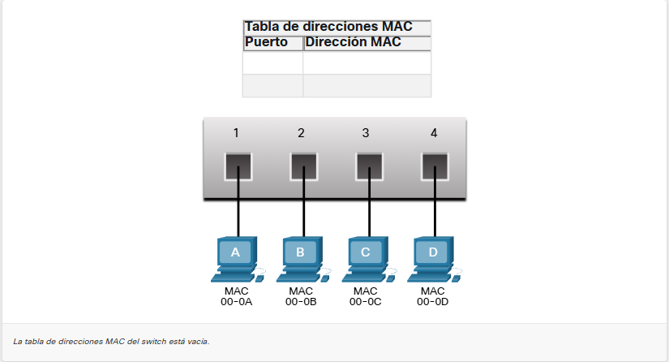

#### Switch, Aprendiendo y Reenviando

El switch aprende dinámicamente las direcciones MAC observando la MAC de origen de las tramas recibidas en cada puerto y las guarda en su tabla. Luego, al recibir una trama, busca la MAC de destino en esa tabla y la reenvía por el puerto correspondiente.

**Examinar la dirección MAC de Origen**

1. **Recepción de la trama:** 
   Cada vez que llega una trama al switch, este primero mira la dirección MAC de origen (quién la envía) y el puerto de entrada*.

2. **Aprendizaje (cuando es nueva):**
   
   - Si esa MAC de origen no está registrada en la tabla del switch, se crea una**entrada nueva:
     
     - Dirección MAC → Puerto de entrada. 
       Esto permite que el switch sepa en qué puerto está conectado ese dispositivo.

3. **Actualización (cuando ya existe):**
   
   - Si la MAC de origen ya estaba registrada en la tabla, el switch reinicia o actualiza el temporizador de esa entrada (por defecto dura 5 minutos en la mayoría de switches).
   
   - Así evita que entradas antiguas se queden ocupando memoria si un dispositivo deja de enviar tramas.

4. **Reemplazo (cuando cambia de puerto):**
   
   - Si la MAC ya estaba, pero en otro puerto, el switch la considera una situación nueva.
   
   - La entrada anterior se sobrescribe con el puerto más reciente.
   
   - Esto refleja que el dispositivo cambió de lugar en la red.

**Ejemplo:**

- Cuando **PC-A** envía una trama hacia **PC-D**, el switch lee la MAC de PC-A.

- Si no estaba en la tabla, la agrega con el puerto por donde entró la trama.

- Así, el switch ya sabe en qué puerto está PC-A para futuras comunicaciones.

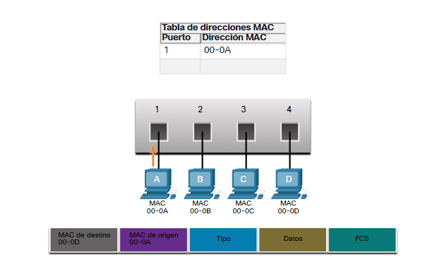

**Buscar dirección MAC de destino**

Cuando una trama entra al switch, además de revisar la MAC de origen, también se fija en la MAC de destino para decidir por dónde reenviar la trama.

---

1. **Destino unicast (una sola máquina)**
- El switch busca la MAC de destino en su tabla de direcciones MAC:
  
  - Si encuentra coincidencia → sabe en qué puerto está ese dispositivo y envía la trama solo por ese puerto (esto se llama unicast directo).
  
  - Si no encuentra coincidencia → el switch desconoce dónde está el dispositivo, entonces reenvía la trama por todos los puertos excepto el de entrad**.
    
    - Esto se llama unicast desconocida (porque la MAC de destino aún no está en la tabla).
2. **Destino broadcast**
- Si la trama es para todas las máquinas (MAC ff:ff:ff:ff:ff:ff), el switch la envía por todos los puertos excepto el de entrada.
3. **Destino multicast**
- Si la trama tiene una dirección de multicast (para un grupo de dispositivos específicos), también se envía por todos los puertos excepto el de entrada, salvo que el switch tenga configuraciones especiales para optimizar este tráfico.

**Ejemplo:**

- Supongamos que **PC-A** quiere enviar algo a **PC-D**.

- El switch no tiene la MAC de PC-D en la tabla, entonces reenvía la trama a todos los puertos (menos el de entrada).

- Cuando PC-D responde, el switch aprenderá su dirección de origen y la registrará en la tabla con el puerto correspondiente.

#### Filtrado de tramas

El switch va aprendiendo y llenando su tabla de direcciones MAC al examinar las tramas recibidas. 
Cuando ya conoce la MAC de destino, filtra la trama y la envía solo al puerto correspondiente, en lugar de difundirla a todos.

**PC-D responde a PC-A**

- La trama de respuesta de PC-D → PC-A llega al puerto 4 del switch.

- El switch examina la MAC de origen (PC-D) y ve que no está en la tabla.

- Agrega la entrada: `MAC PC-D → Puerto 4`

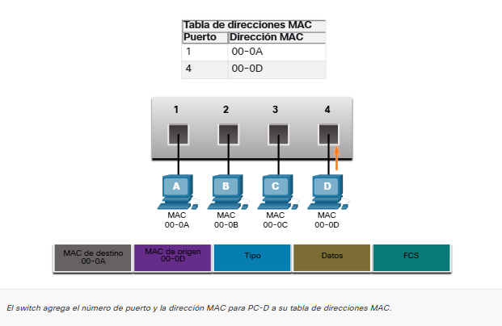

**Switch reenvía hacia PC-A**

- Ahora revisa la MAC de destino (PC-A) de esa trama.

- Como ya la tiene registrada en la tabla (MAC PC-A → Puerto 1), la envía solo por el puerto 1, evitando mandar la trama a todos los puertos.

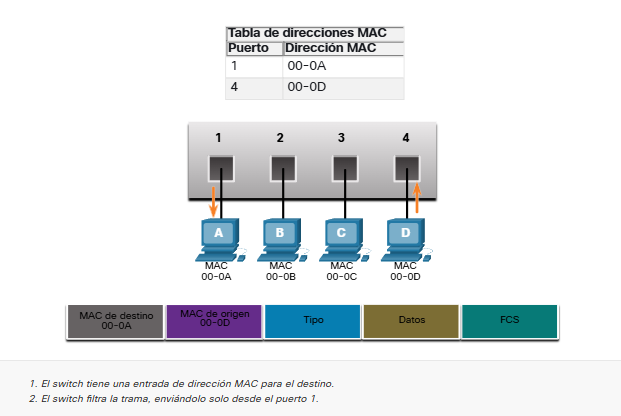

**PC-A envía otra trama a PC-D**

- Cuando PC-A envía de nuevo, el switch revisa la MAC de origen (PC-A).

- Como ya estaba en la tabla, no crea una entrada nueva, pero sí reinicia el temporizador de 5 minutos para mantenerla actualizada.

- Después, revisa la MAC de destino (PC-D).

- Como ya sabe que PC-D está en el puerto 4, envía la trama directamente por ese puerto.

---

### Velocidades y métodos de reenvío del Switch

Los switch's Cisco utilizan dos métodos de reenvío de tramas: store-and-forward y cut-through.

**Store-and-Forward (almacenamiento y envío)**

- El switch recibe la trama completa antes de reenviarla.

- Calcula el CRC (Cyclic Redundancy Check) para verificar si hay errores.

- Si la trama es válida, la reenvía al puerto correspondiente; si tiene errores, la descarta.

- **Ventajas**:
  
  - Garantiza que solo se reenvíen tramas correctas.
  
  - Reduce el consumo de ancho de banda por tramas dañadas.
  
  - Permite aplicar QoS (Calidad de Servicio), muy útil en redes con aplicaciones sensibles al retardo, como VoIP.

- **Desventaja**:
  
  - Introduce más latencia, ya que debe esperar a recibir toda la trama antes de enviarla.

**Cut-Through (método de corte)**

- El switch no espera la trama completa. Apenas lee la dirección de destino, empieza a reenviarla.

- **Ventajas**:
  
  - Tiene una latencia muy baja, ideal para aplicaciones donde la velocidad es más importante que la verificación de errores.

- **Desventajas**:
  
  - Puede propagar tramas dañadas porque no verifica el CRC.
  
  - No soporta análisis de QoS avanzado.

#### Switching por método de corte

En este tipo de conmutación, el switch no espera a recibir toda la trama. Apenas llegan los primeros bytes, lee la dirección MAC de destino (que está en los primeros 6 bytes de la trama) y con eso ya sabe a qué puerto enviarla.

**Variantes del Cut-Through Switching**

1. **Fast-Forward Switching**
- Es la versión más rápida.

- El switch empieza a reenviar la trama inmediatamente después de leer la dirección MAC de destino.

- **Latencia**: Se mide desde que entra el primer bit hasta que sale el primer bit.

- **Problema**: Como no espera ni verifica nada, puede reenviar tramas con errores.

- **Quién corrige**: Si llegan dañadas, la NIC (tarjeta de red) del receptor las detecta y descarta.

2. **Fragment-Free Switching**
- Es un punto medio entre store-and-forward (seguro, pero más lento) y fast-forward (rápido, pero menos seguro).

- El switch espera a recibir los primeros 64 bytes de la trama antes de reenviarla.

- ¿Por qué 64 bytes? Porque la mayoría de errores y colisiones ocurren en ese tramo inicial.

- Esto significa que se gana algo de seguridad contra errores, pero la latencia sigue siendo baja comparada con store-and-forward.

**Comportamiento adaptable de algunos switch's**

Algunos switch's modernos pueden trabajar en modo cut-through mientras no haya demasiados errores.

- Si detectan que las tramas defectuosas superan un umbral de errores definido por el administrador, automáticamente cambian a store-and-forward** (para descartar errores).

- Si el índice de errores baja, vuelven al cut-through para mejorar la velocidad.

#### Almacenamiento en búfer de memoria en los switch's

Cuando un switch recibe una trama pero no puede enviarla de inmediato (porque el puerto de salida está ocupado o hay congestión), utiliza almacenamiento en búfer (buffering) para guardarla temporalmente.

Existen dos métodos principales:

1. **Memoria basada en puerto**
   
   - Cada puerto tiene su propia cola de memoria.
   
   - Una trama se guarda en esa cola hasta que pueda salir.
   
   - Problema: Si un puerto está ocupado, todas las tramas de su cola se retrasan, aunque otras estén listas para enviarse.

2. **Memoria compartida**
   
   - Todas las tramas se guardan en un único búfer común.
   
   - La memoria se asigna de forma dinámica según el puerto que la necesite.
   
   - Ventaja: Mejor aprovechamiento de memoria, menos tramas descartadas y permite manejar conmutación asimétrica (puertos de distinta velocidad, ej. servidor en 10 Gbps y PCs en 1 Gbps).

**Cuadro comparativo**

| Método                       | Características principales                                                                                                     |
| ---------------------------- | ------------------------------------------------------------------------------------------------------------------------------- |
| **Memoria basada en puerto** | Cada puerto tiene su propia cola. Si un puerto está ocupado, todas sus tramas se retrasan.                                      |
| **Memoria compartida**       | Un búfer común para todos los puertos, asignación dinámica. Menos pérdidas de tramas y mejor con puertos de distinta velocidad. |

#### Configuración de dúplex y velocidad

Cada puerto de un switch puede configurarse en dos aspectos importantes:

1. **Ancho de banda (velocidad):** Determina la rapidez de transmisión (10 Mbps, 100 Mbps, 1 Gbps, 10 Gbps, etc.).

2. **Modo dúplex:** Define cómo se envían y reciben los datos.

**Tipos de dúplex en Ethernet**

1. **Dúplex completo (Full-duplex):**
   
   - Los dos dispositivos pueden enviar y recibir al mismo tiempo.
   
   - No hay colisiones, ya que la comunicación es simultánea.
   
   - Es el modo más eficiente.

2. **Semidúplex (Half-duplex):**
   
   - Solo un dispositivo puede transmitir a la vez.
   
   - Si ambos intentan enviar al mismo tiempo, se produce una colisión.
   
   - Era común en redes antiguas con hubs, pero hoy casi no se usa.

**Autonegociación**

- Es una función de la mayoría de switches modernos y tarjetas de red (NICs).

- Permite que dos dispositivos **acuerden** automáticamente:
  
  - La velocidad más alta que ambos soporten.
  
  - El modo dúplex (siempre se elige dúplex completo si es posible).

- Evita errores de configuración manual.

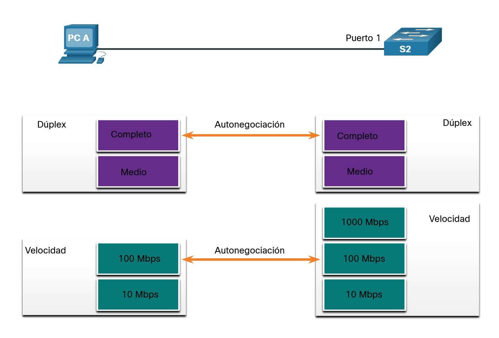

La mayoría de switches Cisco y NIC Ethernet usan negociación automática de velocidad y dúplex por defecto. En Gigabit Ethernet, el funcionamiento siempre es en dúplex completo. Un problema común en redes de 10/100 Mbps es la falta de coincidencia de dúplex, que ocurre cuando un extremo trabaja en medio dúplex y el otro en dúplex completo, lo que genera fallas de rendimiento.

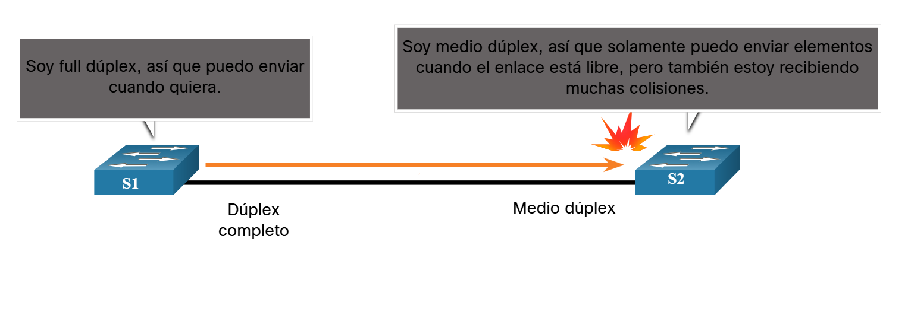

#### Auto-MDIX (MDIX automático)

- **Antes de Auto-MDIX**
  
  - Para conectar dispositivos de red, se debía elegir el cable correcto:
    
    - **Cable directo** → se usaba entre dispositivos diferentes (ej: switch ↔ host, switch ↔ router).
    
    - **Cable cruzado** → se usaba entrebdispositivos similares (ej: switch ↔ switch, router ↔ host).
  
  - Si se usaba el cable incorrecto, la conexión no funcionaba.

- **Con Auto-MDIX**
  
  - Es una función que permite que el puerto del switch detecte automáticamente si debe cruzar o no las señales.
  
  - Gracias a esto, ya no importa si conectas un cable directo o cruzado, el switch ajusta la configuración de la interfaz de manera automática.
  
  - Está habilitada por defecto en los switches Cisco con IOS 12.2 (18) SE o superior.

- **Recomendación práctica**
  
  - Aunque la mayoría de switches modernos ya traen Auto-MDIX activado, existe la posibilidad de que esté deshabilitado en algunos equipos o versiones.
  
  - Por eso, la buena práctica es usar siempre el tipo de cable correcto y no depender de Auto-MDIX.
  
  - Si se necesita, Auto-MDIX puede habilitarse manualmente con el comando:
    
    `Switch(config-if)# mdix auto`
