# Módulo 8 - Capa de red

---

## Contenido

- **Características de la capa de red:** Explica cómo la capa de red utiliza los protocolos IP para una confiabilidad de comunicaciones.
- **Paquete IPv4:** Explica la función de los principales campos de encabezado en el paquete IPv4.
- **Paquete IPv6:** Explica la función de los principales campos de encabezado en el paquete IPv6.
- **Cómo arma las rutas un host:** Explica cómo los dispositivos de red usan tablas de enrutamiento para dirigir paquetes a una red de destino.
- **Tablas de enrutamiento de router:** Explica la función de los campos en la tabla de enrutamiento de un router.

---

### Características de la capa de red

La capa de red (Capa 3 del modelo OSI) permite el intercambio de datos entre dispositivos en distintas redes. Sus principales protocolos son **IPv4** e **IPv6**, y también incluye protocolos de enrutamiento como **OSPF** y de mensajería como **ICMP**.

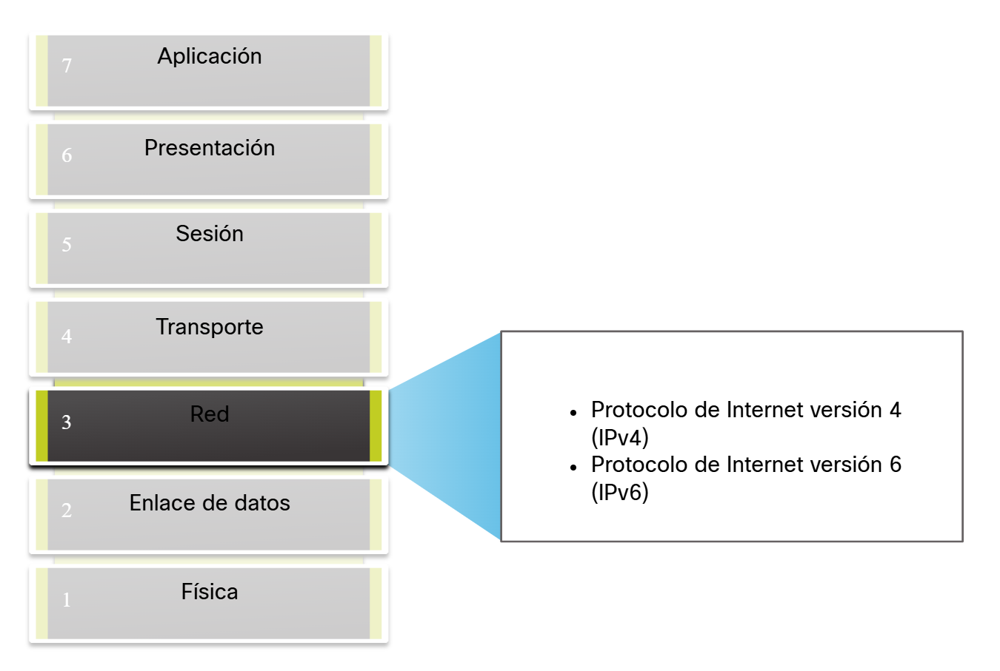

La capa de red (Capa 3 del modelo OSI) se encarga de mover los datos de un dispositivo a otro a través de diferentes redes. Para hacerlo, realiza cuatro funciones principales:

1. **Direccionamiento:** Cada dispositivo necesita una dirección IP única para poder ser identificado y recibir datos.

2. **Encapsulación:** Cuando se envía información, esta se empaqueta con un encabezado que incluye las direcciones IP del origen y el destino.

3. **Enrutamiento:** Los routers deciden la mejor ruta para que los paquetes lleguen a su destino, incluso si deben pasar por varios routers (llamados saltos).

4. **Des encapsulación:** Al llegar al destino, el dispositivo revisa la dirección IP, quita el encabezado y envía los datos a la capa de transporte para su uso final.

La capa de red se encarga de llevar los paquetes desde un host de origen hasta uno de destino, sin importar el tipo de datos que transporten.

#### Encapsulación IP

El proceso de encapsulamiento IP ocurre cuando la capa de red agrega un encabezado IP al segmento de la capa de transporte (TCP o UDP), formando un paquete IP. Este encabezado contiene direcciones IP de origen y destino, que permiten entregar el paquete al host correcto.

Los routers y switches de capa 3 leen este encabezado para decidir la mejor ruta, sin modificar los datos internos; solo cambian las direcciones MAC a medida que el paquete avanza por la red.

Gracias a este proceso, cada capa funciona de forma independiente, lo que permite que IPv4, IPv6 u otros protocolos nuevos operen sin afectar las demás capas.

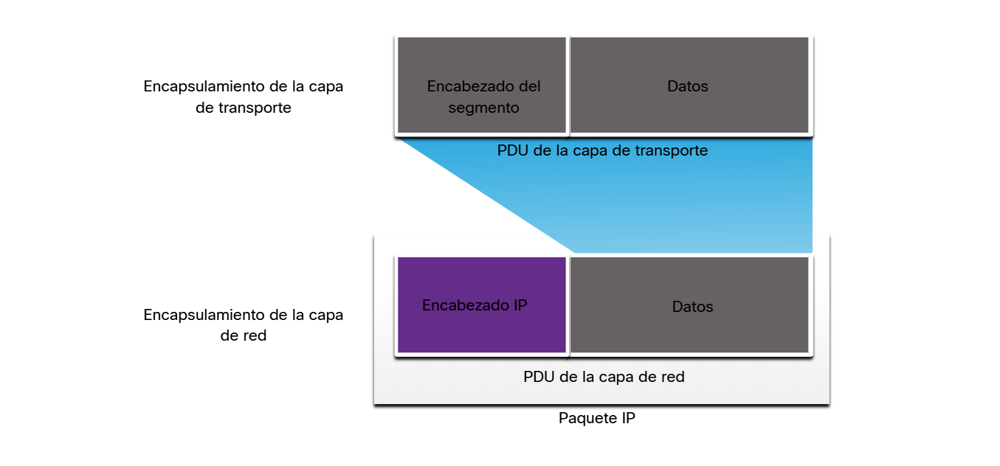

El **NAT (Network Address Translation)** es una función que cambia las direcciones IP dentro de los paquetes, permitiendo que varios dispositivos de una red local compartan una sola IP pública al conectarse a Internet.

El protocolo IP tiene una baja sobrecarga y solo se encarga de enviar paquetes del origen al destino, sin controlar su flujo ni garantizar la entrega. Estas tareas las manejan otros protocolos como **TCP**.

Sus características básicas son:

- **Sin conexión:** No establece conexión previa antes de enviar datos.

- **Mejor esfuerzo:** No garantiza entrega ni orden de los paquetes.

- **Independiente del medio:** Funciona sobre cualquier tipo de red (cable, fibra o inalámbrica).

#### Sin conexión

Decir que IP es un protocolo sin conexión significa que no establece una comunicación previa ni una conexión dedicada entre el emisor y el receptor antes de enviar los datos. Cada paquete se envía de manera independiente, sin verificar si el destino está disponible ni garantizar la recepción. 

*Sin conexión - Analogía*

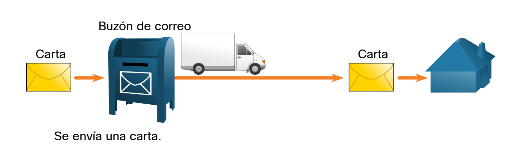

No hay intercambio inicial de control ni mantenimiento de una sesión durante la transmisión; IP simplemente envía los paquetes hacia su destino según la información del encabezado.

*Sin conexión: red*

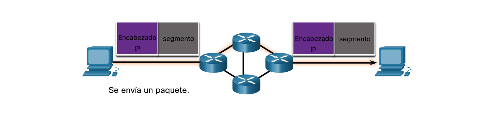

#### Mejor esfuerzo

IP no mantiene conexiones ni usa campos extra en su encabezado, lo que reduce su sobrecarga. Sin embargo, al no establecer una conexión previa, el emisor no puede saber si el destino está disponible ni si los paquetes llegan correctamente. Por ello, IP ofrece una entrega de mejor esfuerzo, sin garantía de recepción ni fiabilidad.

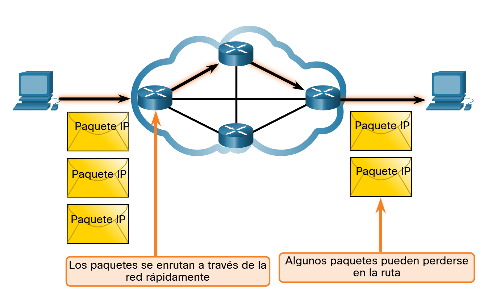

#### Independiente de los medios

IP es poco confiable porque no puede detectar, corregir ni retransmitir paquetes perdidos, dañados o fuera de orden. Solo se encarga de dirigir los datos, sin confirmar su entrega. La confiabilidad es tarea de protocolos de capas superiores, como **TCP**. Además, IP es independiente del medio, por lo que puede transmitir datos sobre cobre, fibra óptica o redes inalámbricas.

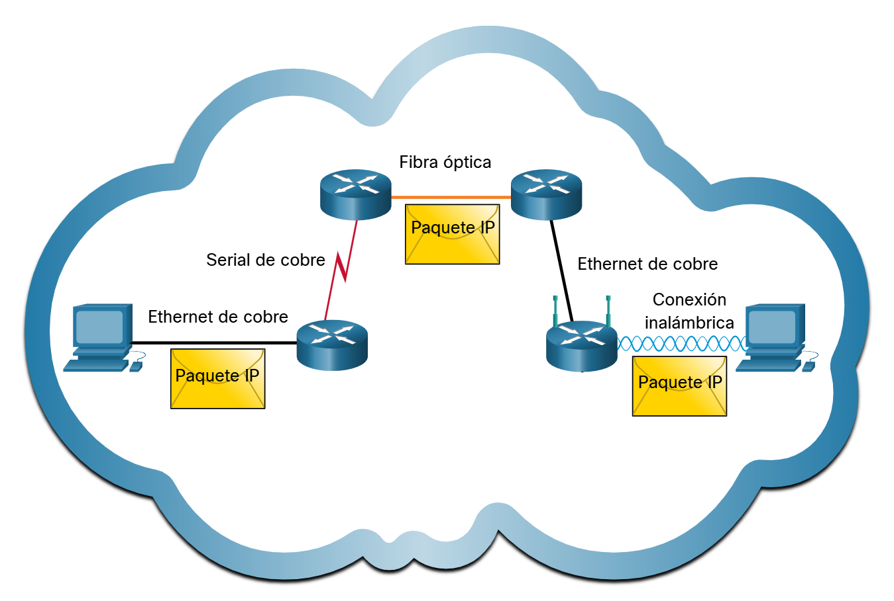

La capa de enlace de datos prepara los paquetes IP para su transmisión por el medio físico, por lo que IP puede funcionar sobre cualquier tipo de red.

La capa de red considera el tamaño máximo de datos que puede transportar cada medio, conocido como **MTU (Unidad de Transmisión Máxima)**. Este valor se comunica desde la capa de enlace a la capa de red para definir el tamaño adecuado de los paquetes.

Si un paquete IPv4 excede la MTU de un medio, un router puede fragmentarlo para reenviarlo, lo que genera latencia. En cambio, los routers no pueden fragmentar paquetes IPv6.

---

### Paquete IPv4

IPv4 es un protocolo principal de la capa de red que usa un encabezado para asegurar que cada paquete llegue a su siguiente destino. 
Este encabezado contiene campos con información binaria que permiten a los dispositivos de capa 3 identificar, enrutar y procesar correctamente los paquetes.

#### Campos de encabezado de paquete IPv4

Los valores binarios de cada campo del encabezado IPv4 indican los parámetros del paquete. 
Los diagramas del encabezado, leídos de izquierda a derecha y de arriba abajo, muestran visualmente la estructura y función de cada campo del protocolo IP.

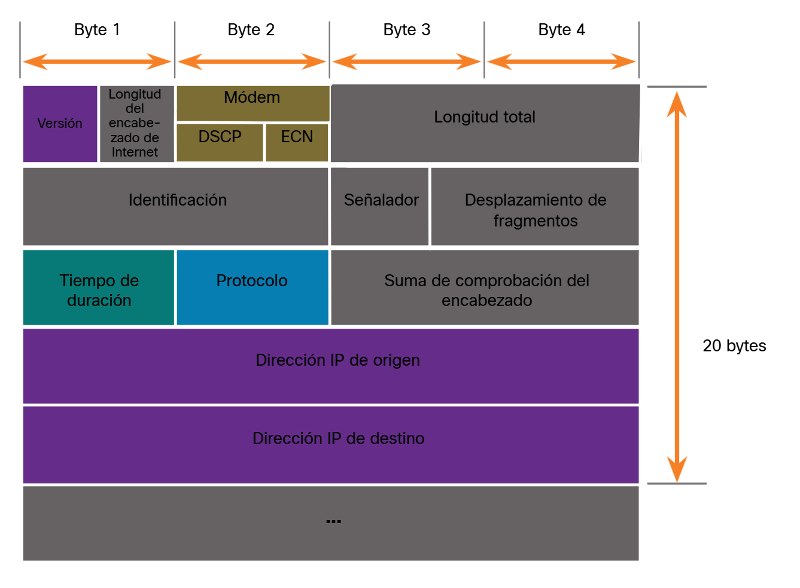

| **Campo**                                      | **Tamaño (bits)** | **Descripción**                                                                                   |
| ---------------------------------------------- | ----------------- | ------------------------------------------------------------------------------------------------- |
| **Versión**                                    | 4                 | Indica la versión del protocolo IP (0100 = IPv4).                                                 |
| **Longitud del encabezado de Internet (IHL)**  | 4                 | Define el tamaño del encabezado en múltiplos de 4 bytes. Permite agregar opciones si se necesita. |
| **DSCP (Servicios Diferenciados)**             | 6                 | Define la prioridad o calidad de servicio (QoS) del paquete.                                      |
| **ECN (Notificación de congestión explícita)** | 2                 | Indica si hay congestión en la red sin descartar paquetes.                                        |
| **Longitud total**                             | 16                | Indica el tamaño total del paquete (encabezado + datos).                                          |
| **Identificación**                             | 16                | Identifica fragmentos de un mismo paquete para su reensamblaje.                                   |
| **Señalador (Flags)**                          | 3                 | Controla o indica si un paquete puede fragmentarse.                                               |
| **Desplazamiento de fragmentos**               | 13                | Indica la posición de un fragmento dentro del paquete original.                                   |
| **Tiempo de duración (TTL)**                   | 8                 | Limita el número de saltos que puede realizar el paquete antes de ser descartado.                 |
| **Protocolo**                                  | 8                 | Indica el protocolo de capa superior que contiene (TCP=6, UDP=17, ICMP=1).                        |
| **Suma de comprobación del encabezado**        | 16                | Permite detectar errores en el encabezado IPv4.                                                   |
| **Dirección IP de origen**                     | 32                | Dirección IP del dispositivo que envía el paquete.                                                |
| **Dirección IP de destino**                    | 32                | Dirección IP del dispositivo al que va dirigido el paquete.                                       |

Los campos más importantes del encabezado IPv4 son las direcciones IP de origen y destino, que indican de dónde proviene y hacia dónde se envía el paquete y normalmente no cambian durante su recorrido.

Los campos IHL, longitud total y suma de comprobación del encabezado sirven para identificar y validar el paquete.

La fragmentación se gestiona mediante los campos identificación, señaladores y desplazamiento de fragmentos, que permiten reensamblar paquetes divididos por diferencias en la MTU.

Los campos Opciones y Relleno existen pero se usan muy poco.

---

### Paquete IPv6

Aunque IPv4 sigue utilizándose, presenta tres grandes limitaciones que llevaron al desarrollo de IPv6:

1. **Agotamiento de direcciones:** El número limitado de direcciones IPv4 (unos 4 000 millones) es insuficiente ante el crecimiento de dispositivos conectados.

2. **Falta de conectividad de extremo a extremo:** El uso de NAT permite compartir una sola dirección pública, pero impide la comunicación directa entre dispositivos.

3. **Mayor complejidad de red:** Las distintas implementaciones de NAT aumentan la latencia y dificultan la solución de problemas, haciendo las redes más complejas.

A comienzos de los 90, el IETF desarrolló IPv6 para superar las limitaciones de IPv4. 
Las principales mejoras son:

- **Direcciones más amplias:** Pasa de 32 a 128 bits, ofreciendo una cantidad prácticamente ilimitada de direcciones.

- **Encabezado simplificado:** Mejora el manejo y procesamiento de paquetes.

- **Elimina el uso de NAT:** Permite conectividad directa entre dispositivos gracias al enorme espacio de direcciones.

#### Comparación del espacio de direcciones de IPv4 e IPv6

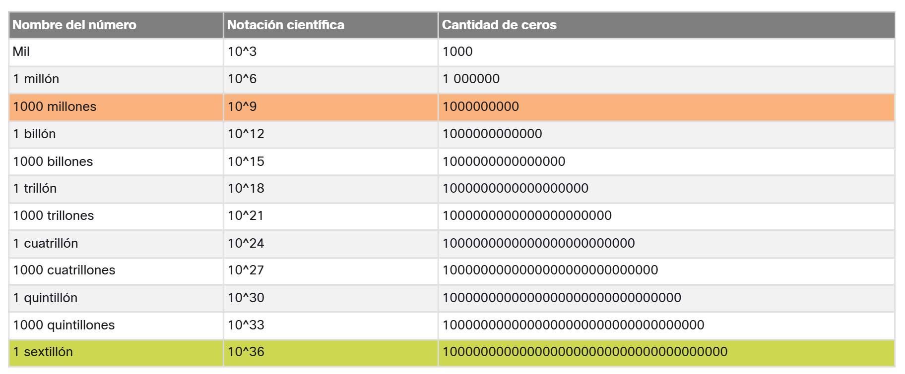

Una mejora clave de IPv6 frente a IPv4 es su encabezado simplificado. 
Mientras IPv4 tiene un encabezado variable de hasta 60 bytes con 12 campos, IPv6 reduce y reorganiza los campos, eliminando los innecesarios para lograr un procesamiento más eficiente.

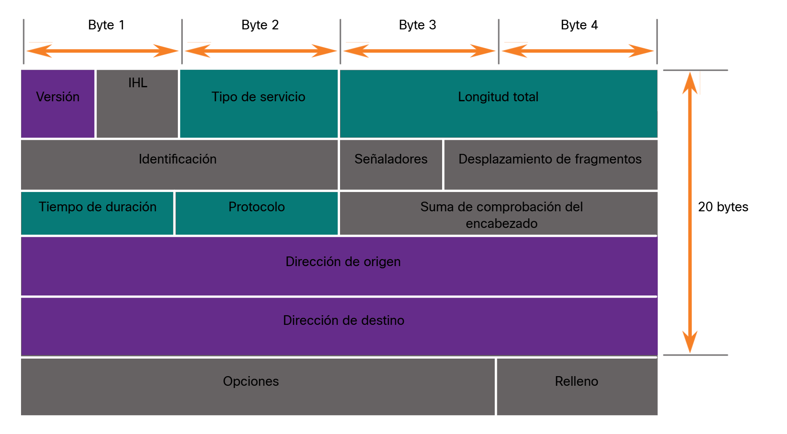

El encabezado de IPv6 tiene una longitud fija de 40 octetos, principalmente por sus direcciones más largas, lo que permite un procesamiento más rápido y eficiente que en IPv4.

#### Encabezado de paquetes IPv6

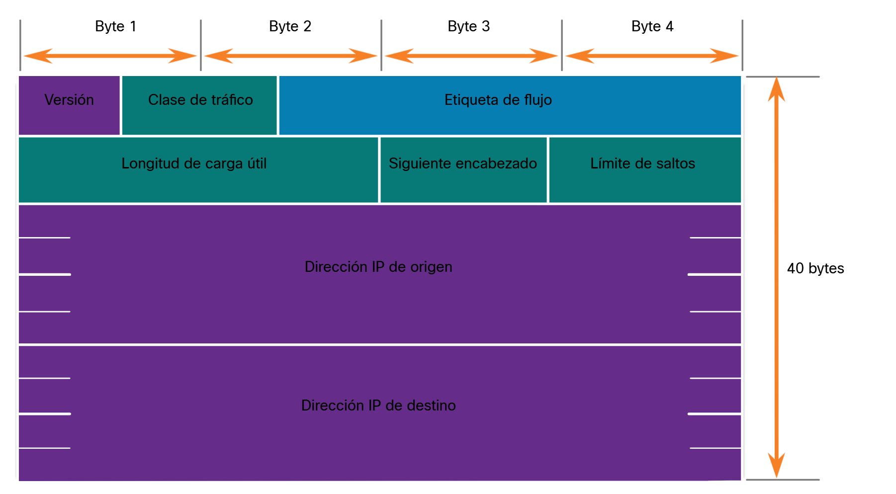

Los campos del encabezado IPv6 son los elementos que permiten identificar, dirigir y gestionar los paquetes de datos en una red basada en esta versión del protocolo IP. En comparación con IPv4, IPv6 simplifica su estructura para mejorar la velocidad de procesamiento y la eficiencia del enrutamiento.

Sus principales campos son:

- **Versión:** Indica que el paquete pertenece a la versión 6 del protocolo IP.

- **Clase de tráfico:** Permite clasificar y priorizar los paquetes según su tipo de servicio o calidad requerida.

- **Etiqueta de flujo:** Agrupa paquetes con el mismo tipo de tratamiento, útil para flujos multimedia o tiempo real.

- **Longitud de carga útil:** Especifica el tamaño de los datos transportados, sin contar el encabezado.

- **Encabezado siguiente:** Identifica el protocolo de la capa superior o el encabezado de extensión que sigue.

- **Límite de salto:** Controla cuántos routers puede atravesar el paquete antes de ser descartado, evitando bucles.

- **Dirección IPv6 de origen:** Indica el emisor del paquete.

- **Dirección IPv6 de destino:** Indica el receptor del paquete.

Además, IPv6 puede incluir encabezados de extensión (EH), que añaden funciones opcionales como seguridad, fragmentación o movilidad. 
A diferencia de IPv4, los routers no fragmentan los paquetes IPv6, lo que optimiza el rendimiento y simplifica el enrutamiento.

---

### ¿Cómo arma las rutas el host?

Tanto en IPv4 como en IPv6, los paquetes se crean en el host de origen, que utiliza su tabla de enrutamiento para dirigirlos al destino.

Un host puede enviar un paquete a:

- **Sí mismo:** Usando la dirección 127.0.0.1 (IPv4) o ::1 (IPv6) para probar su propia pila TCP/IP.

- **Host local:** Cuando el destino está en la misma red que el emisor.

- **Host remoto:** Cuando el destino está en otra red, por lo que el paquete se envía mediante un router.

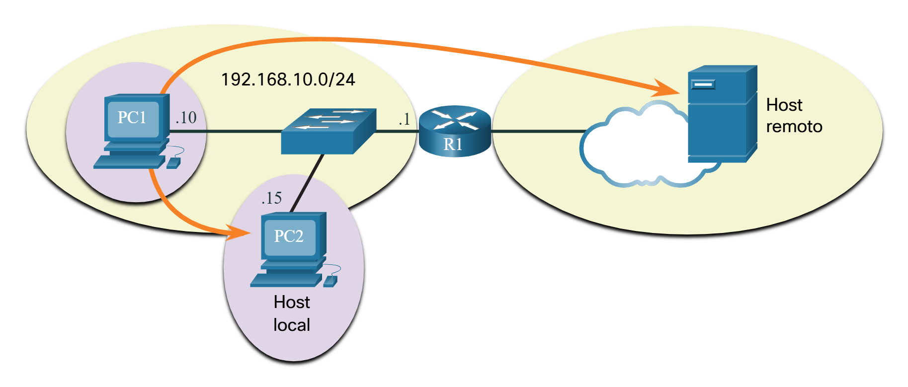

El dispositivo de origen decide si un paquete va a un **host local o remoto**:

- En IPv4, usa su máscara de subred y direcciones IP para comparar redes.

- En IPv6, el router local anuncia el prefijo de red.

Los hosts locales se comunican entre sí por medio de un switch o punto de acceso, sin necesidad de routers. 
Para comunicarse con redes externas, el tráfico se envía al gateway predeterminado (router), que realiza el enrutamiento hacia el destino remoto.

#### Puerta de enlace predeterminada (Gateway)

La puerta de enlace predeterminada es el router o switch de capa 3 que permite enviar tráfico fuera de la red local.

Tiene una IP dentro del mismo rango que los hosts, recibe y reenvía datos fuera de la red y enruta el tráfico hacia otras redes. 
Si no existe o está desactivada, los paquetes no pueden salir de la red local.

#### Un host enruta a la puerta de enlace predeterminada

La tabla de enrutamiento de un host incluye una puerta de enlace predeterminada, que permite enviar tráfico fuera de la red local. 
En IPv4, se obtiene por DHCP o configuración manual, y en IPv6, el router la anuncia o también puede configurarse manualmente.

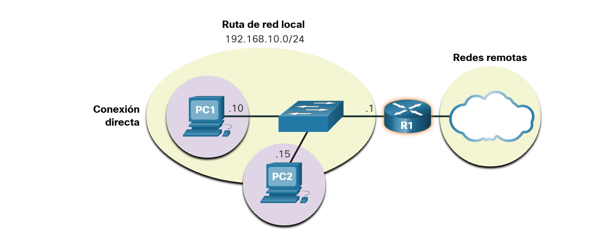

Configurar un gateway predeterminado crea una ruta predeterminada en la tabla de enrutamiento del host, usada para enviar tráfico a redes remotas. 
Así, PC1 y PC2 envían todo el tráfico externo al router R1.

#### Tablas de enrutamiento de host

En Windows, los comandos **`route print`** o **`netstat -r`** muestran la tabla de enrutamiento del host, ofreciendo la misma información. 
Aunque parezca compleja al inicio, su interpretación es sencilla y muestra cómo el host dirige el tráfico en la red.

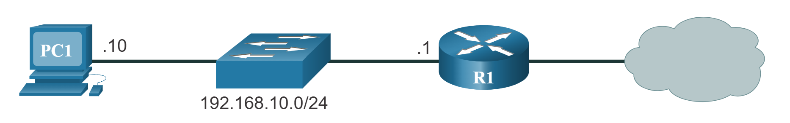

*Ejemplo de tabla de enrutamiento en PC1 con IPv4*

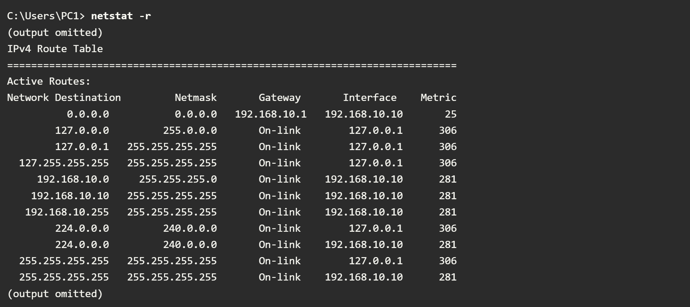

El comando **`netstat -r`** (o **`route print`**) muestra tres secciones principales:

- **Lista de interfaces:** Muestra las direcciones MAC y los números de interfaz de cada conexión del host.

- **Tabla de rutas IPv4:** Incluye todas las rutas IPv4 conocidas, tanto locales como predeterminadas.

- **Tabla de rutas IPv6:** Muestra las rutas IPv6 conocidas, similares a las de IPv4.

---

### Introducción al enrutamiento

Cuando un paquete llega al router, este analiza su dirección IP de destino y consulta su tabla de enrutamiento para decidir a dónde enviarlo. La tabla contiene todas las redes conocidas y sus rutas, y ia disel router reenvía el paquete por la mejor coinciden ponible (la ruta más larga o específica).

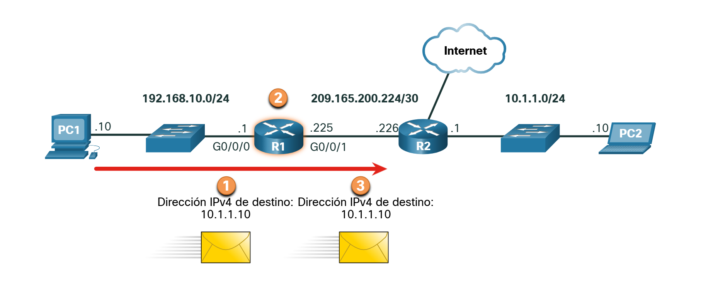
 
*R1 Routing Table*

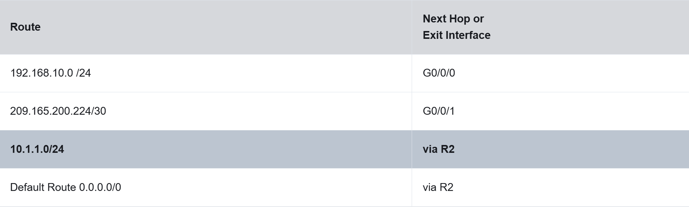

#### Tabla de enrutamiento IP del router

La tabla de enrutamiento de un router guarda tres tipos de rutas:

- **Redes conectadas directamente:** Interfaces activas del router con direcciones IP configuradas.

- **Redes remotas:** Aprendidas manualmente o mediante protocolos de enrutamiento dinámico.

- **Ruta predeterminada:** Usada como última opción cuando no existe una coincidencia específica en la tabla.

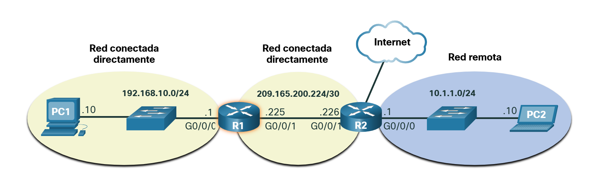

Un router puede descubrir redes remotas de dos maneras:

- **Manualmente** - las redes remotas se ingresan manualmente en la tabla de rutas mediante rutas estáticas.
- **Dinámicamente** - las rutas remotas se aprenden automáticamente mediante un protocolo de enrutamiento dinámico.

#### Enrutamiento estático

Las rutas estáticas se configuran manualmente e indican la red remota y la dirección IP del siguiente salto por donde debe enviarse el paquete.

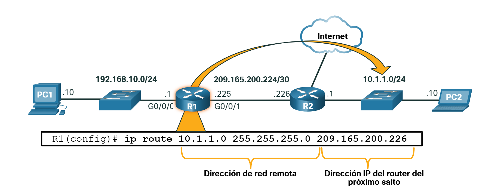

Las rutas estáticas no se actualizan automáticamente ante cambios en la red; deben modificarse manualmente. Si una ruta deja de estar disponible, el administrador debe reconfigurar el router para establecer una nueva ruta válida hacia el destino.

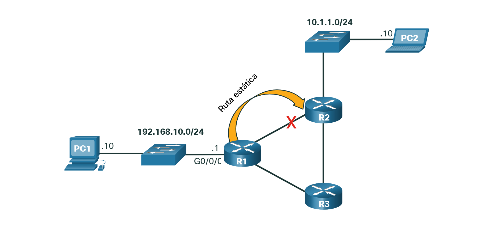

El enrutamiento estático se configura manualmente y requiere ajustes si cambia la topología. Es ideal para redes pequeñas o con pocos enlaces redundantes, y suele combinarse con enrutamiento dinámico para definir la ruta predeterminada.

#### Enrutamiento dinámico

Los protocolos de enrutamiento dinámico como **OSPF** y **EIGRP** permiten que los routers aprendan y actualicen automáticamente rutas remotas y predeterminadas. Así, los routers intercambian información de red y ajustan sus tablas de enrutamiento ante cambios de topología sin intervención manual.

- **OSPF (Open Shortest Path First):** Utiliza el algoritmo de estado de enlace para calcular la ruta más corta hacia cada destino.

- **EIGRP (Enhanced Interior Gateway Routing Protocol):** Usa el algoritmo DUAL para lograr una convergencia rápida y eficiente, optimizando el uso del ancho de banda.

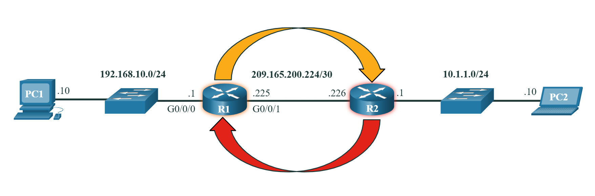

Los routers R1 y R2 usan el protocolo **OSPF** para intercambiar información sobre sus redes conectadas directamente (192.168.10.0/24 y 10.1.1.0/24). 
El protocolo de enrutamiento dinámico detecta redes remotas, mantiene actualizadas las tablas de enrutamiento, selecciona la mejor ruta hacia cada destino y recalcula automáticamente nuevas rutas si ocurre un cambio en la topología de red. 
Así, los routers pueden adaptarse sin intervención manual.

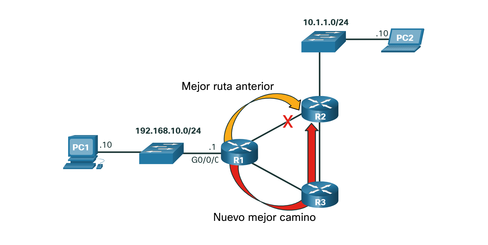

Es común que algunos routers usen una combinación de rutas estáticas y un protocolo de enrutamiento dinámico.

#### Introducción a una tabla de enrutamiento IPv4

R2 está conectado a Internet, por lo que R1 tiene una ruta estática predeterminada que envía los paquetes a R2 cuando no existe una ruta específica. Además, ambos routers usan **OSPF** para anunciar sus redes conectadas directamente.

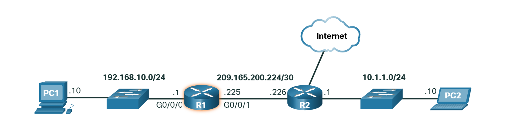

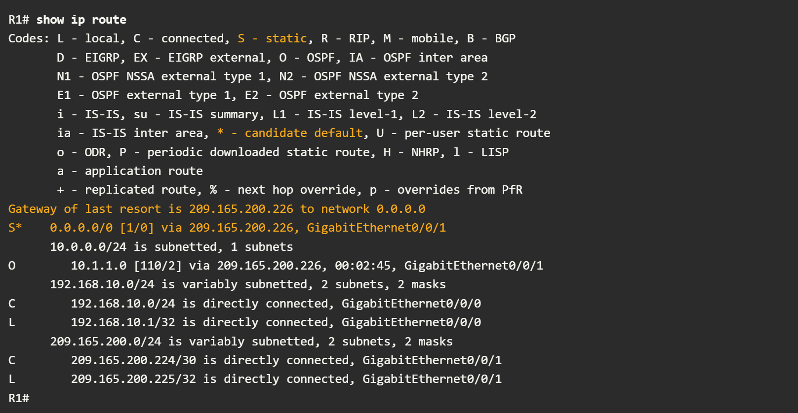

El comando **`show ip route`** permite visualizar la tabla de enrutamiento IPv4 en un router Cisco, mostrando todas las rutas conocidas y cómo se aprendieron. 
Cada entrada incluye un código identificador que indica el tipo de ruta:

- **L (Local)** → Dirección IP asignada directamente a una interfaz del router.

- **C (Connected)** → Red conectada directamente a una interfaz activa.

- **S (Static)** → Ruta configurada manualmente por el administrador.

- **O (OSPF)** → Ruta aprendida dinámicamente mediante el protocolo **OSPF**.

- **D (EIGRP)** → Ruta aprendida dinámicamente mediante **EIGRP**.

En el ejemplo:

- R1 tiene redes conectadas directamente 192.168.10.0/24 y 209.165.200.224/30, marcadas con C y L.

- R1 también aprendió la red 10.1.1.0/24 de R2 mediante **OSPF (O)**.

- La ruta predeterminada se muestra como S* y se usa para enviar paquetes a destinos no específicos (por ejemplo, 0.0.0.0/0 hacia Internet).
