# Módulo 15 - Capa de aplicación

---

## Contenido

- **Aplicación, presentación y sesión:** Explica como las funciones de la capa de aplicación, capa de presentación, y la capa de sesión trabajan juntos para proporcionar servicios de red al usuario final aplicaciones de SP y empresariales.

- **Entre pares:** Explica como funcionan las aplicaciones de usuario final en una red punto a punto.

- **Protocolos web y de correo electrónico:** Explica la forma en que funcionan los protocolos web y de correo electrónico.

- **Servicios de direccionamiento IP:** Explica como funcionan de DNS y DHCP.

- **Servicios de intercambio de archivos:** Explica la forma en que funcionan los protocolos de transferencia de archivos.

---

### Aplicación, presentación y sesión

#### Capa de aplicación

En los modelos OSI y TCP/IP, la **capa de aplicación** es la más cercana al usuario final.  
Su función principal es proporcionar la interfaz entre las aplicaciones que usan los usuarios y la red que transporta los datos.  /
Los protocolos de aplicación permiten el intercambio de información entre los programas que se ejecutan en los hosts de origen y destino.

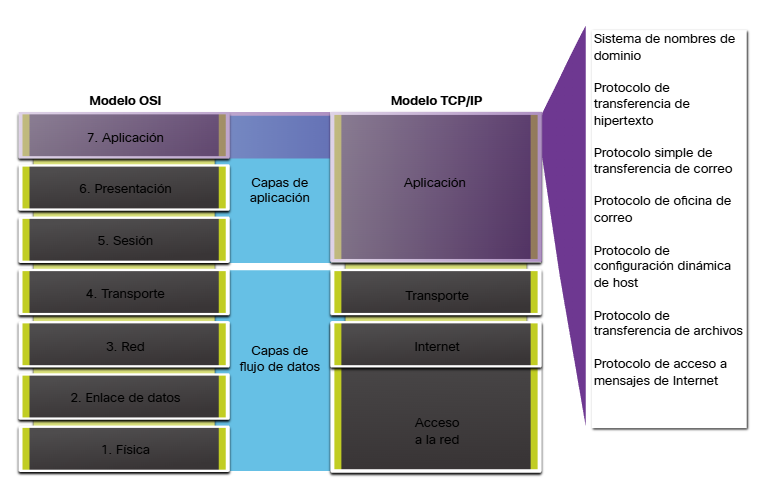

En el modelo TCP/IP, las tres capas superiores del modelo OSI (aplicación, presentación y sesión) se combinan en una sola: la capa de aplicación.  
Esta capa define los protocolos y servicios que permiten la comunicación entre programas en red.  
Entre los protocolos más conocidos se encuentran HTTP, FTP, TFTP, IMAP y DNS, los cuales facilitan diferentes tipos de intercambio de información entre los dispositivos.

#### Capa de presentación y sesión

La **capa de presentación** se encarga de dar formato, comprimir y cifrar los datos para que puedan ser interpretados correctamente por el dispositivo de destino.  
Además, define estándares de formato para distintos tipos de archivos.  
Ejemplos:

- **Video:** QuickTime, MPEG
- **Imágenes:** GIF, JPEG, PNG

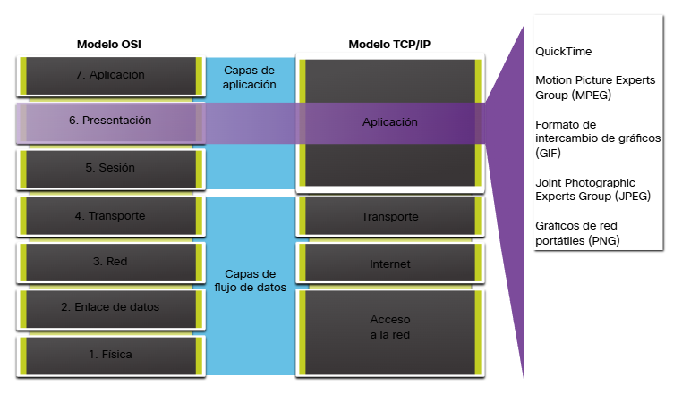

La **capa de sesión** se encarga de crear, mantener y administrar los diálogos entre las aplicaciones de origen y destino.  
Controla el inicio, mantenimiento y restablecimiento de las sesiones de comunicación cuando se interrumpen o permanecen inactivas.

#### Protocolos de capa de aplicación de TCP/IP

Los protocolos de aplicación TCP/IP definen el formato y la información de control necesarios para las funciones de comunicación en Internet.  
Estos protocolos son usados por los dispositivos de origen y destino durante una sesión de comunicación, y para que la comunicación sea correcta, ambos deben usar protocolos de aplicación compatibles.

1. **Sistema de nombres**

   *DNS - Sistema de nombres de dominio (o servicio)*
   
   - TCP, UDP cliente 53
   - Traduce los nombres de dominio tales como cisco.com a direcciones IP

2. **Configuración de host**

   *BOOTP - Protocolo de arranque*
   
   Cliente UDP 68, servidor 67
   
   - Permite que una estación de trabajo sin disco obtenga su propia dirección IP, la dirección IP de un servidor BOOTP en la red y un archivo que se debe cargar en la memoria para arrancar la maquina.
   - El protocolo DHCP reemplaza al protocolo BOOTP.

   *DHCP - Dynamic Host Configuration Protocol*
   
   - ClienteUDP 68, servidor 67
   - Permite que las direcciones vuelvan a utilizarse cuando ya no son necesarias

3. **Correo electrónico**

   *SMTP - Protocolo simple de transferencia de correo.*
   
   - TCP 25
   - Permite a los clientes enviar correo electrónico a un servidor de correo.
   - Permite a los servidores enviar correo electrónico a otros servidores.

   *POP3 - Post Office Protocol*
   
   - TCP 110
   - Permite a los clientes recibir correo electrónico de un servidor de correo.
   - Descarga el correo electrónico a la aplicación de correo local del cliente

   *IMAP - Internet Message Access Protocol*
   
   - TCP 143
   - Permite que los clientes accedan a correos electrónicos almacenados en un servidor de correo.
   - Mantiene el correo electrónico en el servidor.

4. **Transferencia de archivos**

   *Protocolo de transferencia de archivos (FTP, File Transfer Protocol)*
   
   - TCP 20 a 21
   - Establece las reglas que permiten a un usuario en un host acceder y transferir archivos hacia y desde otro host a través de una red.
   - FTP Es un protocolo confiable de entrega de archivos, orientado a la conexión y con acuse de recibo.

   *TFTP - Trivial File Transfer Protocol*
   
   Cliente UDP 69
   
   - Un protocolo de transferencia de archivos simple y sin conexión con entrega de archivos sin reconocimiento y sin el máximo esfuerzo
   - Utiliza menos sobrecarga que FTP.

5. **La web**

   *HTTP- Protocolo de transferencia de hipertexto*
   
   - TCP 80, 8080
   - Un Conjunto de reglas para intercambiar texto, imágenes gráficas, sonido, video y otros archivos multimedia en la World Wide Web.

   *HTTPS - HTTP Secure*
   
   - TCP, UDP 443
   - El navegador usa cifrado para proteger las comunicaciones HTTP.
   - Autentica el sitio web al que se conecta el navegador.

---

### Punto a punto

#### Modelo cliente-servidor

En el modelo cliente-servidor, el cliente solicita información y el servidor responde enviando los datos. Ambos procesos pertenecen a la capa de aplicación.  
Los protocolos de aplicación definen cómo se formatean y transmiten las solicitudes y respuestas, e incluso pueden incluir autenticación o identificación de archivos.

Un ejemplo es el correo electrónico, donde el cliente (como una PC) solicita mensajes al servidor del ISP, que los envía al usuario.  
La transferencia del cliente al servidor se llama carga (upload), y del servidor al cliente, descarga (download).

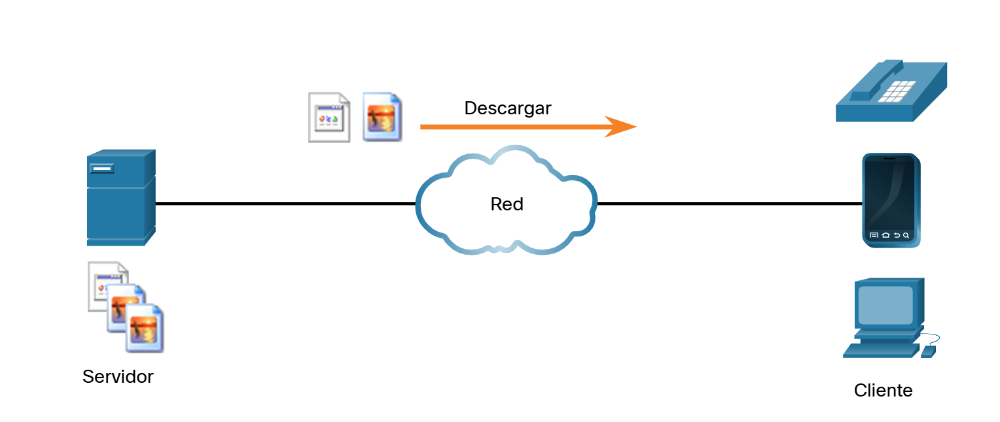

#### Redes entre pares

En el modelo de red entre pares (P2P), no existe un servidor dedicado: todos los equipos pueden actuar como cliente y servidor al mismo tiempo.  
Los dispositivos conectados comparten recursos como archivos, impresoras o conexión a Internet directamente entre ellos.  
Cada par es igual en la comunicación, y las funciones de cliente o servidor se asignan según la solicitud.  
Este modelo permite compartir datos, jugar en red o imprimir entre equipos de forma sencilla y descentralizada.

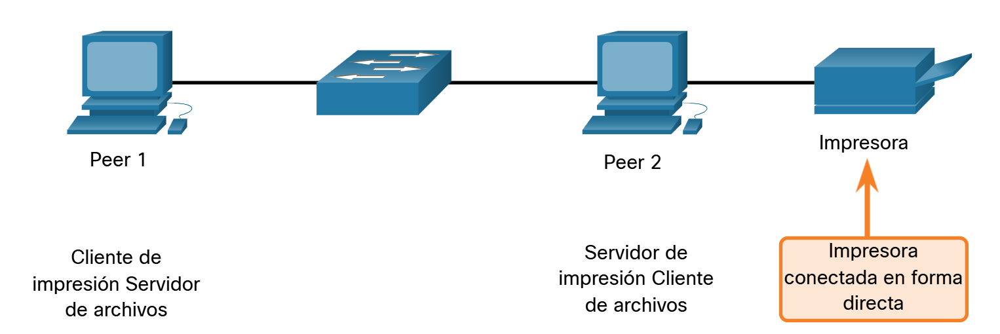

#### Peer-to-peer Applications

Una aplicación P2P permite que cada dispositivo actúe simultáneamente como cliente y servidor, ofreciendo una interfaz para el usuario y un servicio en segundo plano.  
Algunas usan un modelo híbrido, donde el intercambio de recursos es descentralizado, pero los índices de ubicación de esos recursos se guardan en un servidor central que facilita encontrarlos.

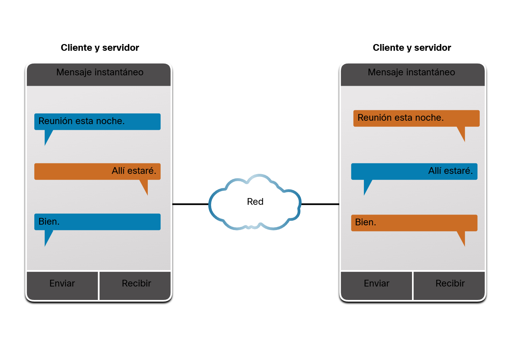

#### Aplicaciones P2P comunes

Las aplicaciones P2P permiten que cada PC actúe como cliente y servidor al mismo tiempo.  
Entre las redes P2P más comunes están BitTorrent, Conexión directa, eDonkey y Freenet.  
Algunas usan el protocolo Gnutella, que permite compartir archivos completos entre usuarios conectados a Internet mediante software compatible como uTorrent, BitComet, DC++, Deluge y eMule.

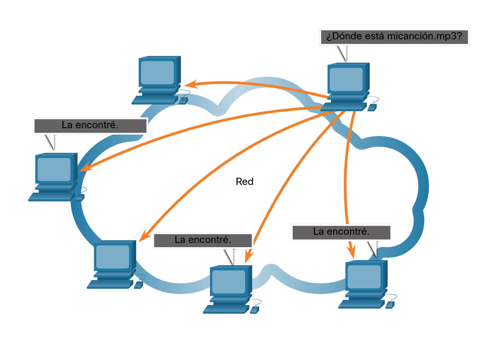

Las aplicaciones P2P permiten compartir partes de varios archivos simultáneamente.  
El sistema usa un archivo torrent, que contiene información sobre los usuarios con las piezas disponibles y los servidores de seguimiento que coordinan las descargas.  
Esta tecnología se conoce como BitTorrent, y existen varios clientes como uTorrent, Deluge y qBittorrent.  
**Nota:** Compartir o descargar archivos con derechos de autor sin permiso es ilegal y puede generar sanciones penales o civiles.

---

### Protocolos web y de correo electrónico

Cuando se ingresa una dirección web (URL o URI) en un navegador, este se conecta al servidor web mediante el protocolo HTTP, que es un protocolo de la capa de aplicación.  
El servidor web procesa la solicitud y envía la página solicitada al navegador, como en el ejemplo **[http://www.cisco.com/index.html](http://www.cisco.com/index.html)**, donde el navegador accede al sitio web de Cisco y muestra la página indicada.

1. **Paso 1**

   El explorador interpreta las tres partes del URL:
   
   - http (el protocolo o esquema)
   - www.cisco.com (el nombre del servidor)
   - index.html (el nombre de archivo específico solicitado)

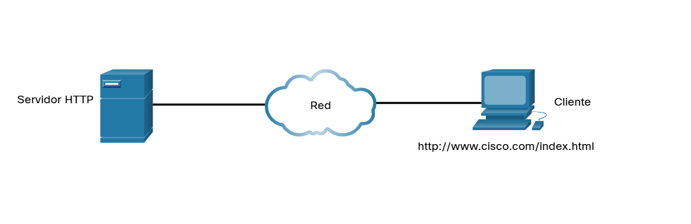

2. **Paso 2**

   El navegador consulta un servidor DNS para convertir el nombre **[www.cisco.com](http://www.cisco.com)** en una dirección IP numérica. Luego, el cliente (navegador) envía una solicitud HTTP tipo GET al servidor web, pidiendo el archivo index.html.

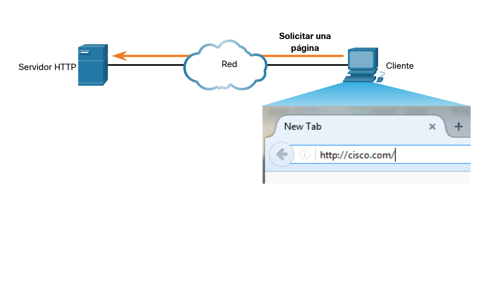

3. **Paso 3**

   En respuesta a la solicitud, el servidor envía el código HTML de esta página web al navegador.

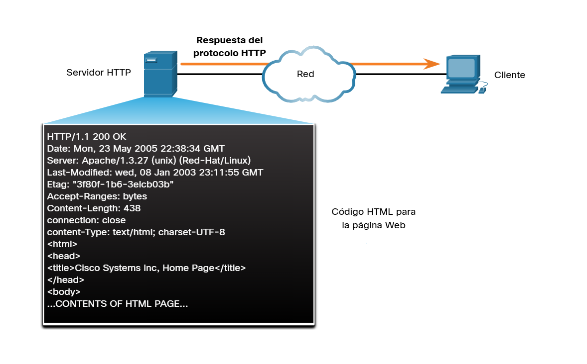

4. **Paso 4**

   El navegador descifra el código HTML y da formato a la página para que se pueda visualizar en la ventana del navegador.

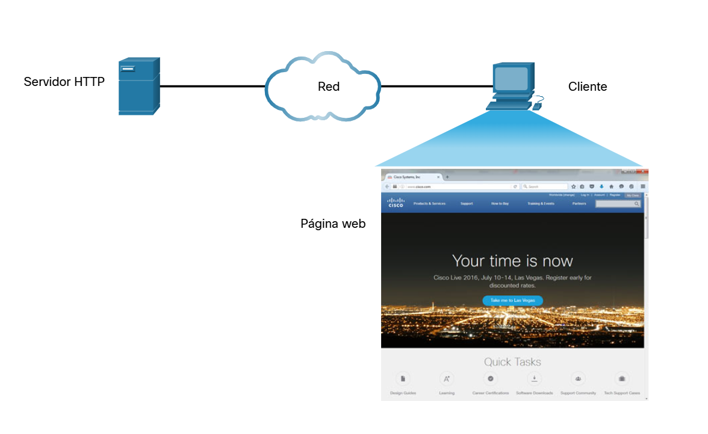

#### HTTP y HTTPS

HTTP funciona con un modelo de solicitud/respuesta entre cliente y servidor.  
Los principales tipos de mensajes son:

- **GET:** El cliente solicita datos o páginas HTML del servidor.
- **POST:** El cliente envía datos o formularios al servidor.
- **PUT:** El cliente carga recursos o archivos (como imágenes) en el servidor.

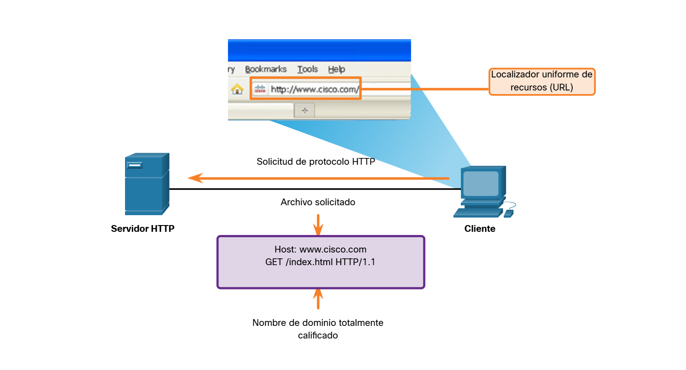

HTTP no es seguro porque transmite la información en texto sin cifrar, lo que permite que sea interceptada.  
Para proteger la comunicación se usa HTTP, que agrega autenticación y cifrado mediante SSL (Secure Sockets Layer), garantizando que los datos viajen de forma segura entre cliente y servidor.

#### Protocolos de correo electrónico 

El correo electrónico es un sistema de almacenamiento y reenvío que permite enviar, guardar y recuperar mensajes a través de una red.  
Los ISP ofrecen el servicio de hosting de correo, y los mensajes se almacenan en servidores de correo mediante aplicaciones y servicios especializados que gestionan su envío y recepción.

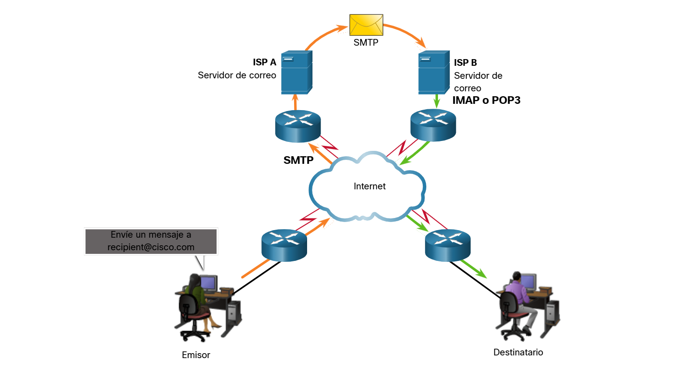

Los clientes de correo electrónico no se envían mensajes directamente entre sí; en cambio, usan servidores de correo como intermediarios para enviar y recibir mensajes entre dominios.
Existen tres protocolos principales para el funcionamiento del correo electrónico:

- **SMTP (Simple Mail Transfer Protocol):** Se usa para enviar correos desde el cliente al servidor o entre servidores.
- **POP (Post Office Protocol):** Permite al cliente descargar los correos desde el servidor y, por lo general, los elimina del servidor después.
- **IMAP (Internet Message Access Protocol):** Permite acceder y gestionar los correos directamente en el servidor, manteniendo la sincronización entre varios dispositivos.

#### SMTP, POP e IMAP

1. **SMTP**

   El SMTP utiliza mensajes con encabezado (que incluye remitente y destinatario) y cuerpo (el contenido del mensaje).  
   Cuando un cliente envía un correo, se conecta al servidor SMTP por el puerto 25, y este lo entrega al destinatario local o lo reenvía a otro servidor.  
   Si el servidor de destino está ocupado o fuera de línea, el mensaje se almacena en una cola y el servidor intenta reenviarlo periódicamente.  
   Si después de varios intentos no se puede entregar, el mensaje se devuelve al remitente como no entregado.

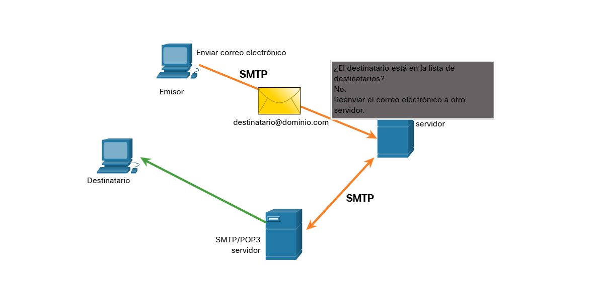

2. **POP**

   El POP permite que una aplicación recupere correos desde un servidor al cliente, descargándolos y eliminándolos del servidor por defecto.  
   El servidor POP escucha en el puerto TCP 110 y, tras establecer la conexión con el cliente, ambos intercambian comandos y respuestas hasta cerrar la sesión.  
   Debido a que los mensajes se eliminan del servidor, POP no ofrece almacenamiento centralizado, por lo que no es ideal para empresas que requieren copias de respaldo.  
   La versión más común es POP3.

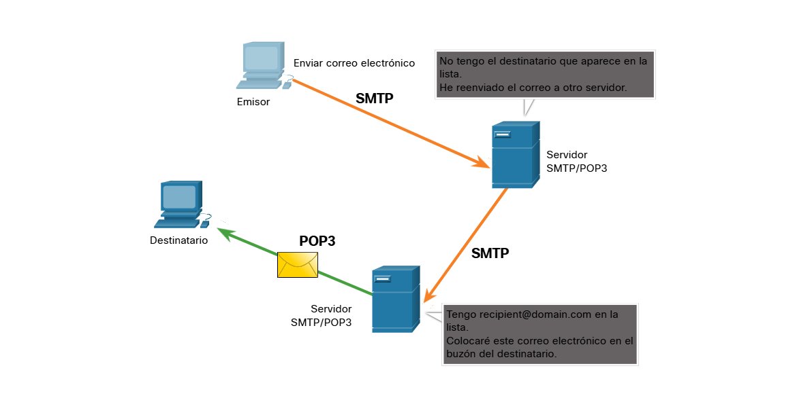

3. **IMAP**

   IMAP permite recuperar correos manteniendo los mensajes originales en el servidor, mientras el cliente descarga solo copias.  
   El usuario puede organizar los mensajes en carpetas dentro del servidor, y esa estructura se refleja en el cliente de correo.  
   Cuando se elimina un mensaje en el cliente, el servidor sincroniza la acción y borra el mensaje definitivamente.
   A diferencia de POP, IMAP mantiene los correos centralizados y sincronizados entre varios dispositivos.

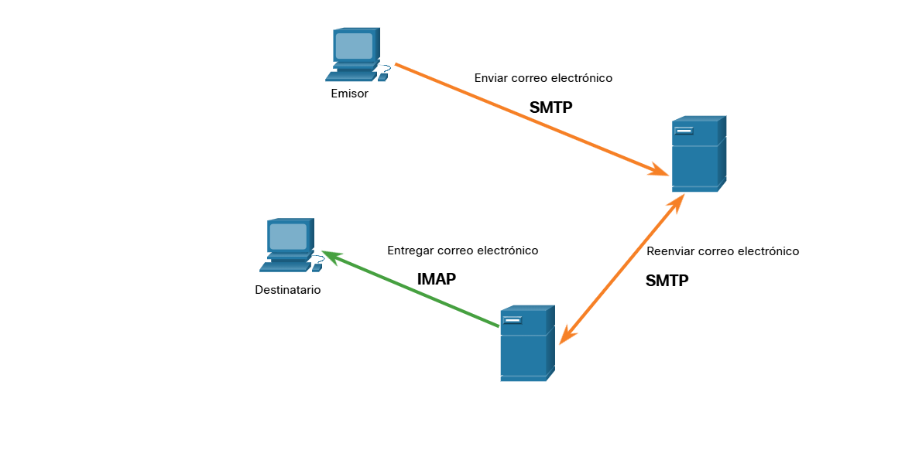

---
### Servicios de direccionamiento IP

#### Servicios de nombres de dominios

El protocolo DNS traduce los nombres de dominio (como _[www.cisco.com](http://www.cisco.com)_) en sus direcciones IP numéricas, facilitando la conexión entre dispositivos sin que el usuario deba recordar números.  
Si una dirección IP cambia, el nombre de dominio sigue siendo el mismo, manteniendo la conexión.  
DNS define un servicio automatizado que gestiona estas conversiones mediante un formato de mensaje estándar, usado para solicitudes, respuestas, errores y transferencias de información entre servidores.

1. **Paso 1**

   El usuario escribe un FQDN en un campo Dirección de aplicación del explorador.

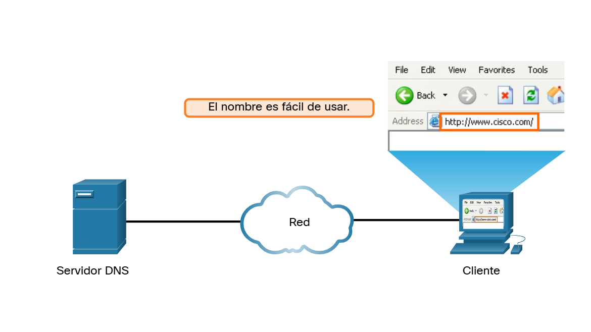

2. **Paso 2**

   Se envía una consulta DNS al servidor DNS designado para el equipo cliente.

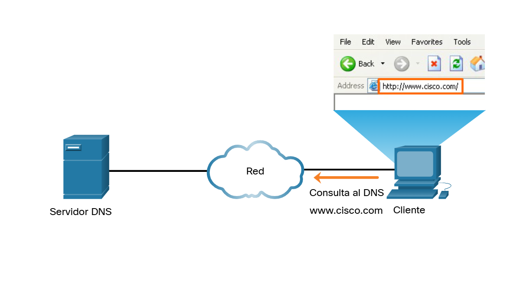

3. **Paso 3**

   El servidor DNS coincide con el FQDN con su dirección IP.

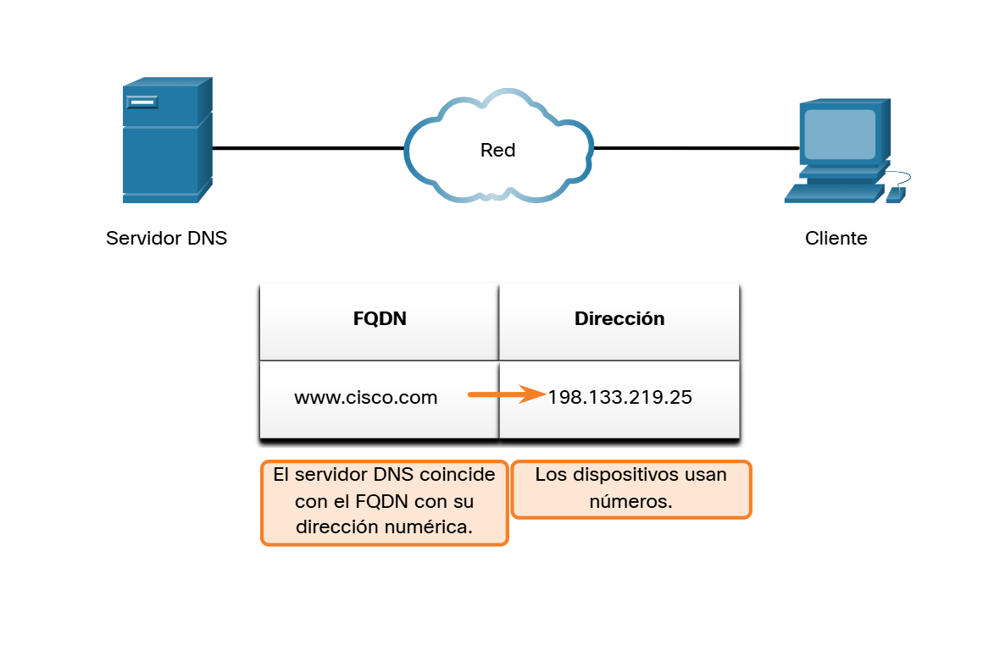

4. **Paso 4**

   La respuesta de consulta DNS se envía de nuevo al cliente con la dirección IP del FQDN.

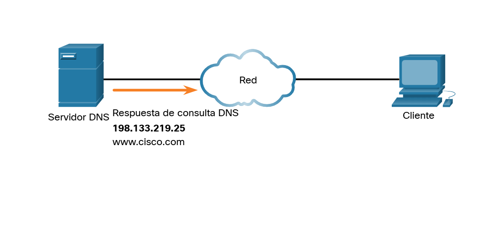

5. **Paso 5**

   El equipo cliente utiliza la dirección IP para realizar solicitudes del servidor.

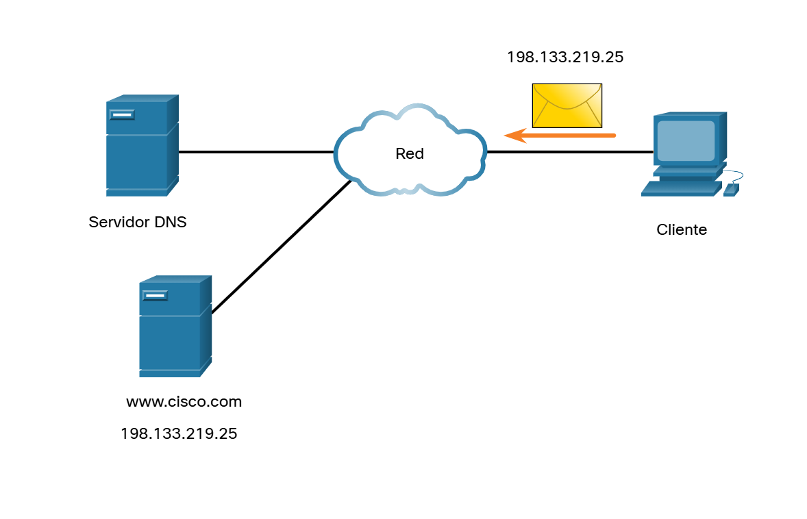

#### Formato de mensaje DNS

El servidor DNS guarda distintos registros de recursos que vinculan nombres con direcciones y tipos, como:

- **A:** Dirección IPv4
- **AAAA:** Dirección IPv6
- **NS:** Servidor de nombres autoritativo
- **MX:** Intercambio de correo

Cuando un cliente hace una consulta, el servidor DNS busca en sus registros; si no encuentra coincidencia, contacta a otros servidores. Una vez obtenida la dirección, la almacena temporalmente en caché para futuras consultas.  
Los equipos también guardan resoluciones previas en memoria, visibles con el comando `ipconfig /displaydns`.  
El formato de mensaje DNS es único y se usa tanto para solicitudes, respuestas y errores como para transferencias entre servidores.

| Sección de mensajes DNS | Descripción                                            |
| ----------------------- | ------------------------------------------------------ |
| Pregunta                | La pregunta para el servidor de nombres                |
| Respuesta               | Registros de recursos que responden la pregunta        |
| Autoridad               | Registros de recursos que apuntan a una autoridad      |
| Adicional               | Registros de recursos que poseen información adicional |

#### Jerarquía DNS

El protocolo DNS utiliza un sistema jerárquico de nombres de dominio dividido en zonas pequeñas administradas por distintos servidores, cada uno responsable de una parte de la base de datos.  
Si un servidor no puede resolver un nombre, reenvía la solicitud a otro servidor dentro de la zona correspondiente, lo que hace que el sistema sea escalable y distribuido.

Los dominios de nivel superior (TLD) indican el tipo de organización o país, por ejemplo:

- **.com:** Empresas o industrias
- **.org:** Organizaciones sin fines de lucro
- **.au:** Australia
- **.co:** Colombia

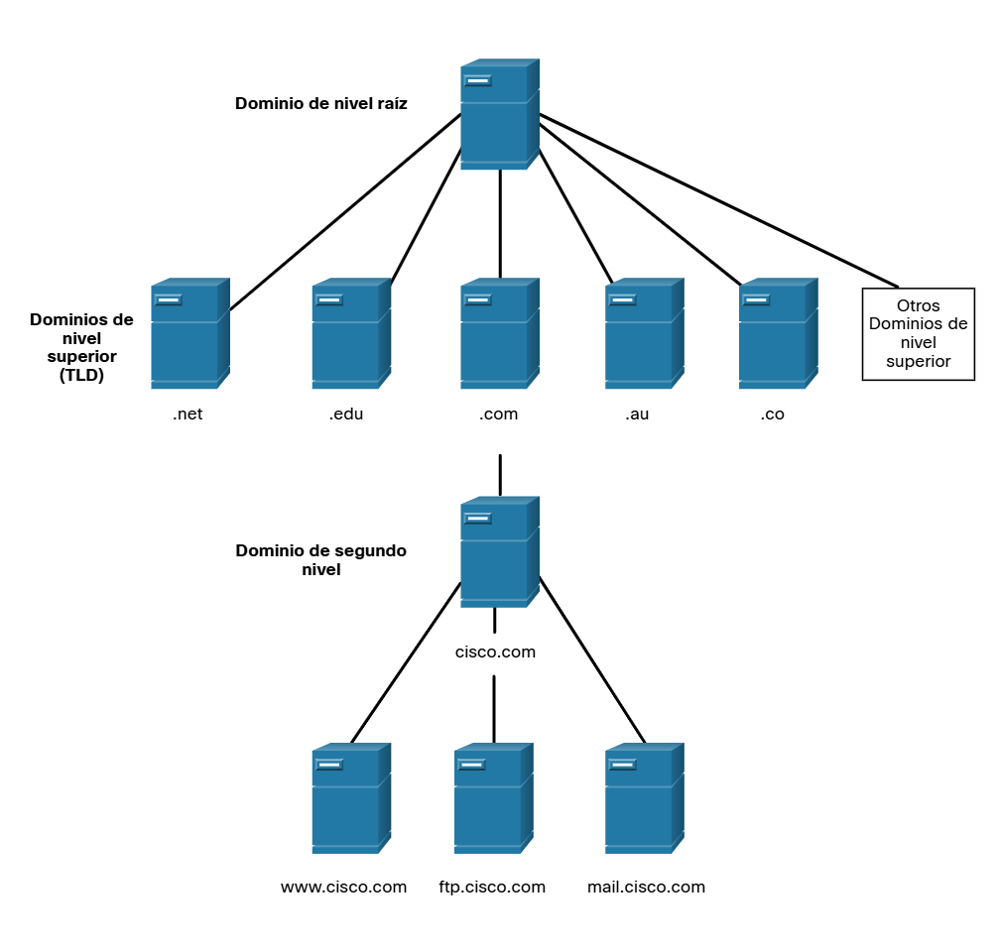

#### El comando nslookup

Al configurar un dispositivo de red, se asignan direcciones de servidores DNS (normalmente proporcionadas por el ISP) para resolver nombres en direcciones IP.  
Cuando una aplicación solicita conectarse a un nombre, el cliente DNS consulta al servidor configurado.

Además, los sistemas operativos incluyen la herramienta nslookup, que permite consultar manualmente los servidores DNS, verificar la resolución de nombres y diagnosticar problemas en el proceso DNS mostrando el servidor predeterminado y los resultados de las consultas.

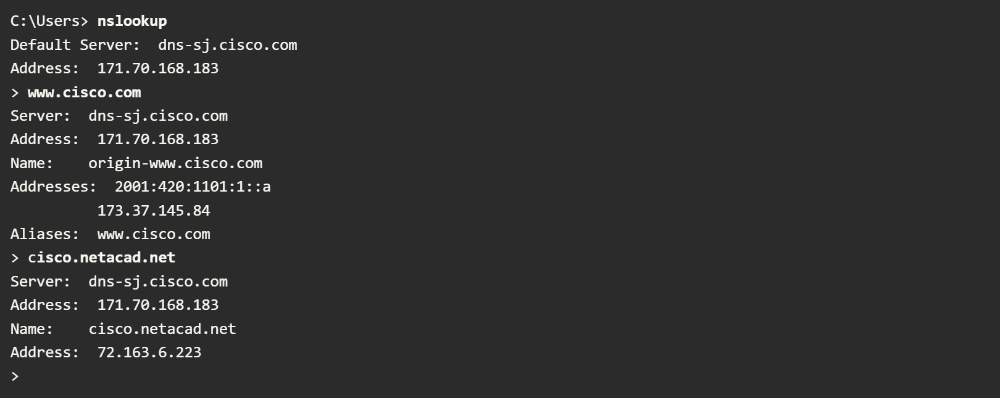

#### Protocolo de configuración

El protocolo DHCP automatiza la asignación de direcciones IPv4, máscaras, gateways y otros parámetros de red, proceso conocido como direccionamiento dinámico, en contraste con el direccionamiento estático, que requiere configuración manual.

Cuando un host se conecta, solicita una dirección al servidor DHCP, el cual la asigna de un rango de direcciones llamado grupo. Las direcciones se otorgan por un período de concesión, tras el cual pueden renovarse o liberarse para su reutilización.

DHCP es ideal para redes grandes o con usuarios móviles, ya que facilita la conexión automática de nuevos dispositivos.  
Los servidores DHCP pueden ser servidores dedicados en redes empresariales o estar integrados en routers domésticos que conectan la red local con el ISP.

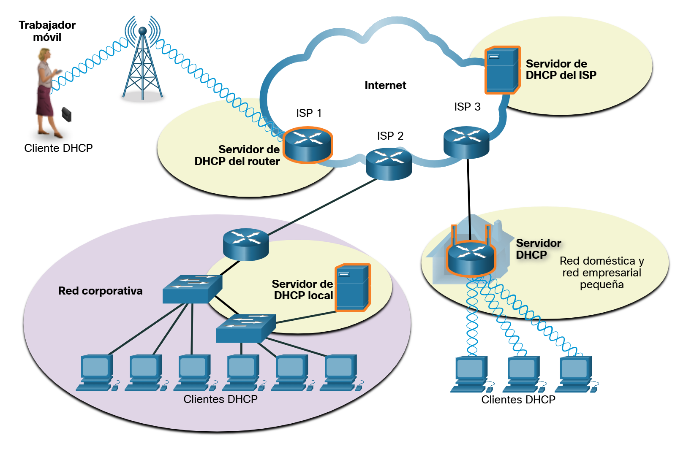

Muchas redes combinan direccionamiento estático y DHCP:

- DHCP se usa para hosts de propósito general (como computadoras y dispositivos de usuarios).
- Direccionamiento estático se usa para dispositivos de red (gateways, switches, servidores e impresoras).

En IPv6, DHCPv6 cumple funciones similares, pero no asigna la dirección del gateway predeterminado, ya que esta se obtiene dinámicamente mediante los anuncios de router.

#### Funcionamiento de DHCP

Cuando un dispositivo con DHCP e IPv4 se conecta a la red, envía un mensaje DHCPDISCOVER para buscar servidores DHCP.  
Un servidor DHCP responde con un DHCPOFFER, que incluye:

- La dirección IPv4 asignada.
- La máscara de subred.
- Las direcciones del DNS y del gateway predeterminado.
- Y la duración de la concesión.

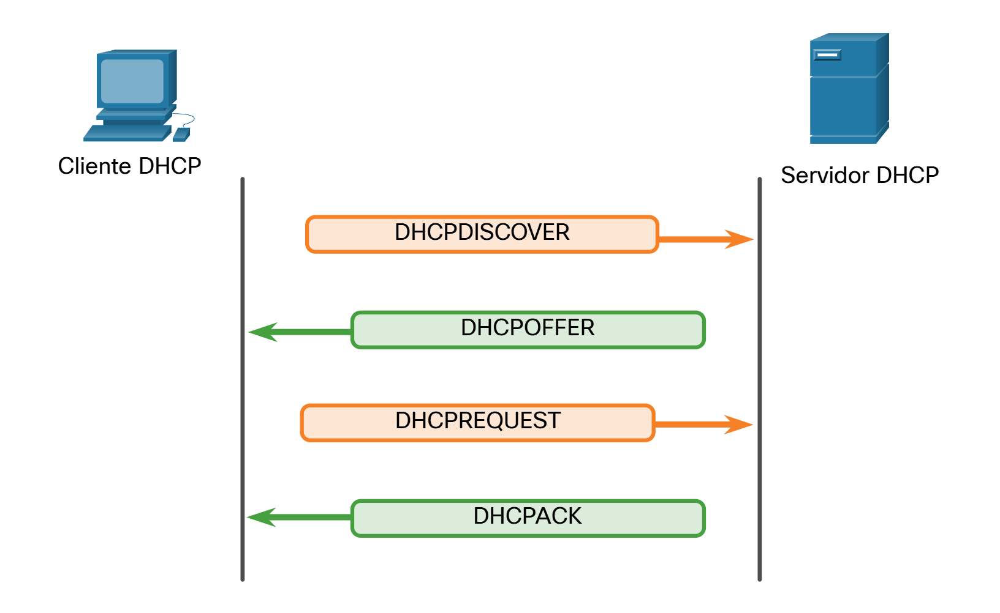

Cuando un dispositivo con DHCP se conecta, puede recibir varias ofertas (DHCPOFFER) si hay varios servidores.  
El cliente elige una oferta y envía un mensaje DHCPREQUEST para indicar qué servidor y dirección acepta.

Luego, el servidor responde con:

- DHCPACK, si la dirección aún está disponible, confirmando la concesión.
- DHCPNAK, si la dirección ya no es válida, lo que obliga al cliente a reiniciar el proceso con un nuevo DHCPDISCOVER.

El cliente debe renovar su concesión antes de que expire usando otro DHCPREQUEST.  
El servidor garantiza que no haya direcciones IP duplicadas.  
Los proveedores de Internet (ISP) también usan DHCP para asignar direcciones IP dinámicas a sus clientes.

En IPv6, el proceso es similar, pero los mensajes se llaman:  
SOLICIT, ADVERTISE, INFORMATION REQUEST y REPLY.

---

### Servicios de intercambio de archivos

#### Protocolo de transferencia de archivos

El protocolo FTP permite transferir archivos entre un cliente y un servidor dentro del modelo cliente/servidor.
El cliente FTP es una aplicación que se ejecuta en la computadora del usuario y permite subir (insertar) o descargar (extraer) datos desde un servidor FTP.  
FTP es un protocolo de capa de aplicación, al igual que HTTP o los protocolos de correo electrónico.

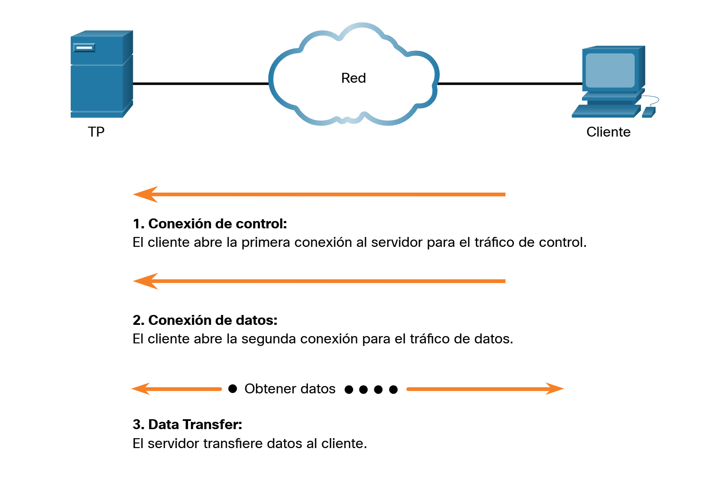

FTP utiliza dos conexiones TCP entre el cliente y el servidor:

- Una conexión de control por el puerto 21, donde se envían comandos y respuestas.
- Una conexión de datos por el puerto 20, que se abre cada vez que se transfieren archivos.

Los datos pueden transferirse en ambas direcciones: el cliente puede descargar (extraer) o subir (insertar) archivos al servidor.

#### Bloque de mensajes del servidor

El protocolo SMB (Server Message Block) permite el intercambio y uso compartido de archivos, impresoras y otros recursos en una red mediante un modelo cliente/servidor.

SMB utiliza un formato de mensaje con un encabezado fijo y una parte variable de datos, basado en un sistema de solicitud y respuesta*: el cliente pide algo y el servidor responde.

1. Inicia, autentica y termina sesiones entre cliente y servidor.
2. Controla el acceso a archivos e impresoras compartidos.
3. Permite que aplicaciones envíen o reciban mensajes de otros dispositivos.

**Nota:** Antes de Windows 2000, SMB usaba su propio protocolo para resolver nombres. Desde Windows 2000 en adelante, SMB utiliza TCP/IP y DNS, lo que lo hace más compatible y eficiente en redes modernas.

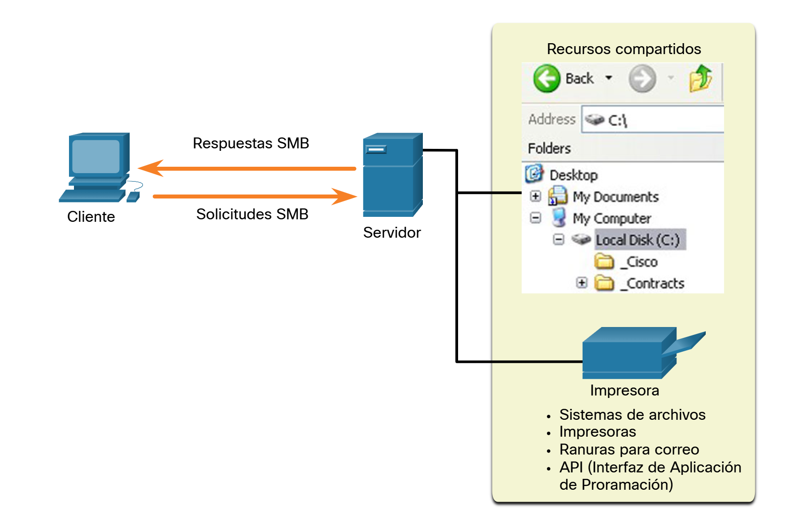

*SMB es un protocolo del tipo cliente-servidor, solicitud-respuesta. Los servidores pueden hacer que sus recursos estén disponibles en la red para que los usen los
clientes.*

El proceso de intercambio de archivos de SMB entre equipos Windows es así:

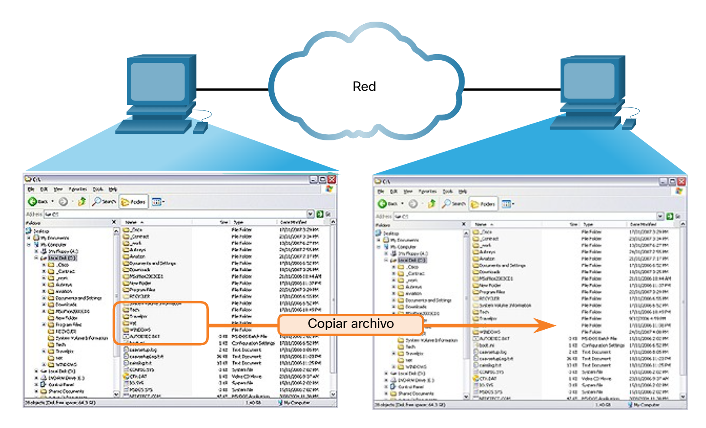

A diferencia de FTP, el protocolo SMB mantiene una conexión permanente entre el cliente y el servidor, permitiendo acceder a los recursos del servidor como si fueran locales.

Además, Linux y Unix usan una versión de SMB llamada Samba para compartir archivos con redes de Microsoft, y los sistemas Macintosh también son compatibles con SMB para el intercambio de recursos.

